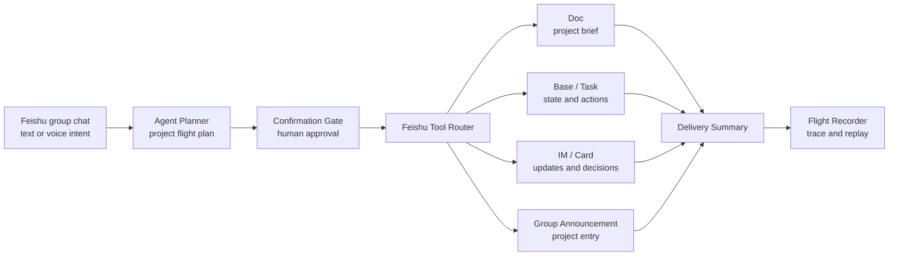
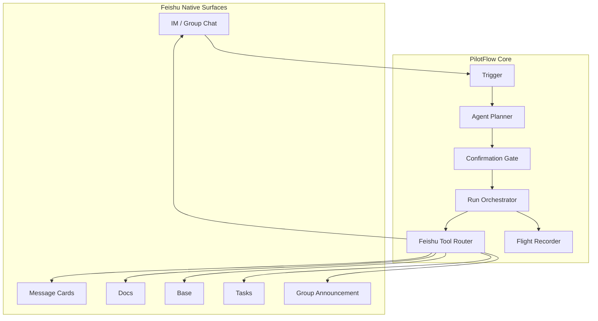
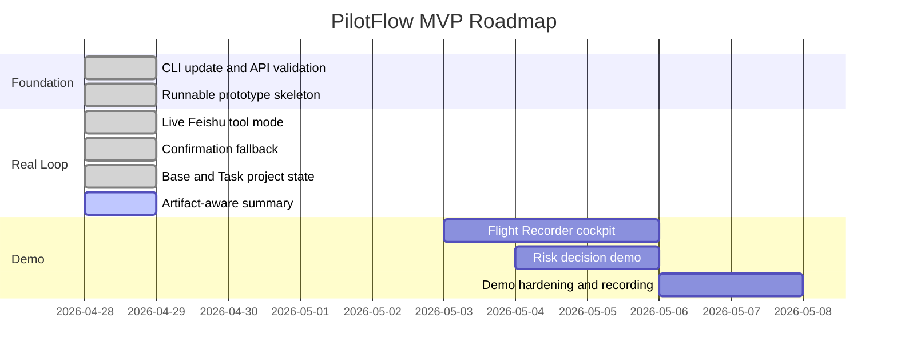

<div align="center">

# ✈️ PilotFlow

**飞书群里的 AI 项目运行官**<br/>
**A Feishu-native AI project operations officer inside your group chat**

把群聊里的目标、承诺、风险和材料，推进成确认过的计划、可执行任务、可追踪状态和交付总结。<br/>
Turn group-chat discussion into confirmed plans, executable tasks, traceable state, and delivery summaries.

[](#-mvp-progress)
[](#-feishu-native-surfaces)
[](#-product-experience)
[](docs/DEVELOPMENT.md)
[](docs/DEVELOPMENT.md)
[](https://github.com/DeliciousBuding/pilot-flow/stargazers)
[](https://github.com/DeliciousBuding/pilot-flow/commits/main)

[中文](#-中文) · [English](#-english) · [Product](docs/PRODUCT_SPEC.md) · [Architecture](docs/ARCHITECTURE.md) · [Roadmap](docs/ROADMAP.md) · [Docs](docs/README.md)

</div>

---

## 📖 Table of Contents

- [📌 中文](#-中文)
- [🌍 English](#-english)
- [🎯 Why PilotFlow](#-why-pilotflow)
- [🧭 Product Experience](#-product-experience)
- [🔁 Product Loop](#-product-loop)
- [🧠 Architecture](#-architecture)
- [🧩 Feishu-Native Surfaces](#-feishu-native-surfaces)
- [🧪 MVP Progress](#-mvp-progress)
- [🗺️ Roadmap Snapshot](#-roadmap-snapshot)
- [📚 Documentation](#-documentation)
- [⚡ Prototype Demo](#-prototype-demo)
- [🔐 Safety Principles](#-safety-principles)
- [📈 Star History](#-star-history)
- [🤝 Contributing](#-contributing)
- [🙏 Acknowledgments](#-acknowledgments)

## 📌 中文

PilotFlow 不是普通聊天机器人，不是文档生成器，也不是只面向程序员的代码 Agent。它的产品定位是：

> **像一个项目经理一样，在飞书群里推动团队从讨论走向交付。**

在真实协作里，项目的关键信息经常散落在群聊中：目标、负责人、截止时间、风险、材料、确认意见、临时承诺。PilotFlow 让 AI Agent 成为主驾驶，负责理解讨论、生成项目飞行计划、请求人类确认、调用飞书原生工具，并把结果沉淀到 Doc、Base、Task、群公告和总结消息中。

GUI 或 Chat Tab 不是主流程，它只是仪表盘和辅助操作台。真正的产品体验应该发生在团队已经工作的地方：**飞书 IM、卡片、文档、多维表格和任务系统**。

## 🌍 English

PilotFlow is a Feishu-native AI project operations officer. It lives inside a group chat, understands project intent, proposes a flight plan, asks for human confirmation, executes through Feishu tools, records every step, and sends a delivery summary back to the team.

The product principle is simple:

> **Agent as Pilot. GUI as cockpit. Humans stay in control.**

PilotFlow is designed for practical team operations first: fewer lost decisions, fewer forgotten tasks, clearer project state, and a traceable AI workflow.

## 🎯 Why PilotFlow

| Team pain | PilotFlow response | Feishu-native output |
| --- | --- | --- |
| Discussion is scattered across group messages | Extract goals, members, deadlines, deliverables, and risks | Project flight plan |
| Verbal agreement is hard to track | Ask for explicit confirmation before side effects | Card or text confirmation |
| Tasks and risks disappear in chat history | Write structured project state | Base records and Tasks |
| Project entry points are hard to find | Publish a stable project entry | Group announcement or entry message |
| AI actions are hard to trust | Record plans, tool calls, artifacts, fallbacks, and errors | Flight Recorder |

## 🧭 Product Experience


## 🔁 Product Loop



## 🧠 Architecture



Detailed architecture: [docs/ARCHITECTURE.md](docs/ARCHITECTURE.md).

## 🧩 Feishu-Native Surfaces

| Surface | Product role | MVP status |
| --- | --- | --- |
| IM | Main collaboration entry and summary channel | ✅ validated |
| Cards | Flight plan, confirmation, risk decision | ✅ static card validated |
| Docs | Project brief and delivery documents | ✅ creation validated |
| Base | Tasks, risks, artifacts, confirmations | ✅ rich fallback fields prototype |
| Task | Concrete owner/deadline action items | ✅ creation validated, text owner fallback |
| Group Announcement | Stable project entrance | 🟡 entry-message fallback prototype |
| Event subscription | `@PilotFlow` automatic trigger | 🟡 planned |
| Chat Tab / H5 | Lightweight cockpit and flight recorder | ✅ static recorder prototype |
| Whiteboard / Calendar / Slides | Demo enhancement surfaces | ⏳ later |

## 🧪 MVP Progress

PilotFlow is currently in **MVP prototype** stage. The first deliverable is a reliable Feishu-native project launch loop, not a separate project-management SaaS.

| Capability | Status |
| --- | --- |
| Activity tenant authorization | ✅ validated |
| Test group creation | ✅ validated |
| Group IM send | ✅ validated |
| Static interactive card send | ✅ validated |
| Feishu Doc creation | ✅ validated |
| Base state write | ✅ validated |
| Base owner/deadline fallback fields | ✅ prototype |
| Task creation | ✅ validated |
| Local Flight Recorder | ✅ prototype |
| Real one-command Feishu run | ✅ validated |
| Project flight plan card | ✅ dry-run prototype |
| Project entry message fallback | ✅ prototype |
| Artifact-aware final summary | ✅ prototype |
| Duplicate live-run guard | ✅ prototype |
| Flight Recorder static view | ✅ prototype |
| Card callback confirmation | 🟡 next |
| Group announcement project entry | 🟡 next |

## 🗺️ Roadmap Snapshot



Full roadmap: [docs/ROADMAP.md](docs/ROADMAP.md).

## 📚 Documentation

| Document | Purpose |
| --- | --- |
| [Docs Index](docs/README.md) | Complete documentation map |
| [Project Brief](docs/PROJECT_BRIEF.md) | Product and competition brief |
| [Product Spec](docs/PRODUCT_SPEC.md) | User promise, feature tiers, non-goals |
| [Architecture](docs/ARCHITECTURE.md) | Components, state model, tool routing |
| [Development Guide](docs/DEVELOPMENT.md) | Local setup, validation, profiles, GitHub sync |
| [Visual Design](docs/VISUAL_DESIGN.md) | Feishu-native cards, cockpit, UX rules |
| [Roadmap](docs/ROADMAP.md) | Long-term plan and immediate next actions |
| [Documentation Plan](docs/DOCUMENTATION_PLAN.md) | Documentation governance |

## ⚡ Prototype Demo

For local development and reviewer reproduction:

```bash
npm run check
npm run demo:manual
npm run demo:manual -- --send-plan-card --no-auto-confirm
npm run demo:manual -- --send-entry-message
npm run flight:recorder -- --input tmp/runs/latest-manual-run.jsonl
npm run test:artifacts
npm run test:card
npm run test:guard
npm run test:entry
npm run test:flight
npm run test:state
npm run test:summary
```

The current local demo reads a project-init fixture, writes a traceable run log, and returns planned artifacts. Live Feishu execution is available behind an explicit confirmation gate; detailed setup lives in [docs/DEVELOPMENT.md](docs/DEVELOPMENT.md).

## 🔐 Safety Principles

- Human confirmation is required before publishing project artifacts.
- Tool failures must be recorded and surfaced.
- The Agent must not pretend a failed Feishu write succeeded.
- Every write path should be designed for idempotency or duplicate detection.
- Live project-init runs are guarded against accidental duplicate Feishu writes unless explicitly bypassed.
- Secrets never belong in the repository, public docs, screenshots, or chat logs.
- Official Feishu reference caches stay outside this repo.

## 📈 Star History

[](https://star-history.com/#DeliciousBuding/pilot-flow&Date)

## 🤝 Contributing

PilotFlow is moving quickly toward a competition MVP. Changes should keep the main loop stable:

```text
Group chat -> Flight plan -> Confirmation -> Feishu tools -> State -> Risk decision -> Delivery summary
```

Before opening a change:

1. Run the relevant validation.
2. Update the affected docs.
3. Keep official reference caches and local secrets out of the repo.

## 🙏 Acknowledgments

- Feishu / Lark Open Platform and `lark-cli`.
- Feishu AI Campus Challenge materials and challenge brief.
- Agent engineering tools that influenced the worker-artifact roadmap.
