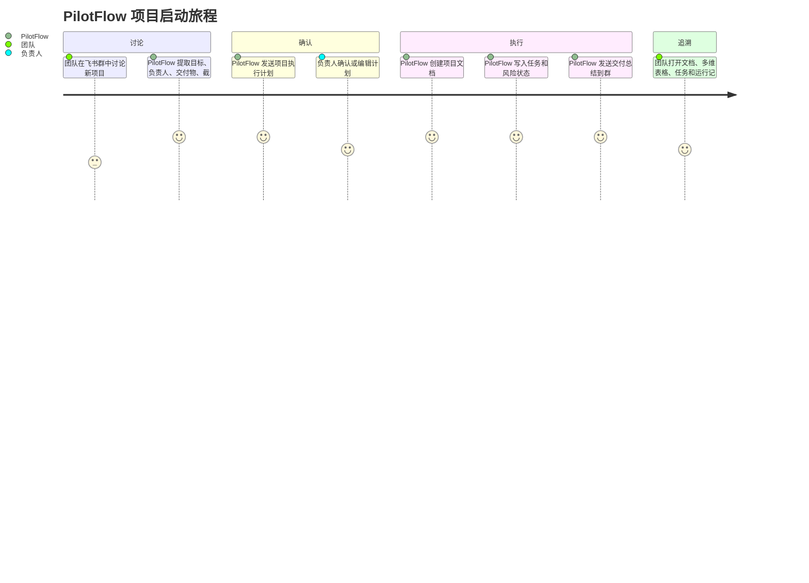
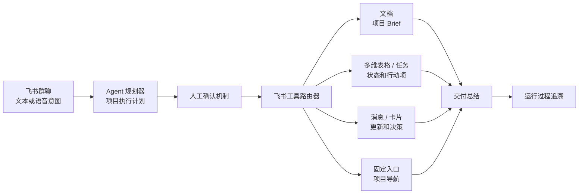
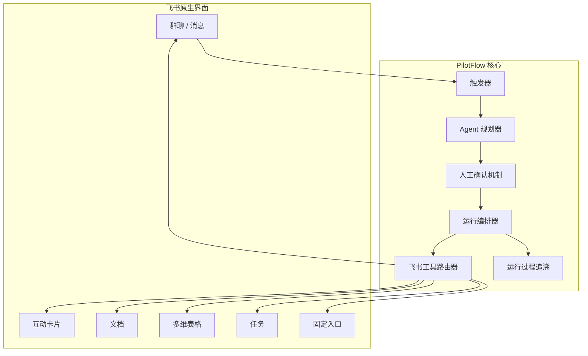

<div align="center">

# ✈️ PilotFlow

**飞书项目协作的 AI 运行层**

从群聊讨论开始，把目标、负责人、风险和材料推进成确认过的计划、可执行任务、可追踪状态和交付总结。

[English Version](README_EN.md)

[](#-飞书原生能力)
[](#-产品体验)
[](docs/OPERATOR_RUNBOOK.md)
[](https://github.com/DeliciousBuding/pilot-flow/stargazers)
[](https://github.com/DeliciousBuding/pilot-flow/commits/main)

[产品规格](docs/PRODUCT_SPEC.md) · [架构设计](docs/ARCHITECTURE.md) · [路线图](docs/ROADMAP.md) · [操作手册](docs/OPERATOR_RUNBOOK.md) · [文档索引](docs/README.md)

</div>

---

> **截图占位**：飞书群聊中 PilotFlow 发送执行计划卡片的效果截图。

---

## 一句话介绍

**PilotFlow 是飞书群里的 AI 项目运行官——像一个项目经理一样，在飞书群里推动团队从讨论走向交付。**

在真实协作里，项目的关键信息经常散落在群聊中：目标、负责人、截止时间、风险、材料、确认意见、临时承诺。PilotFlow 让 AI Agent 成为主驾驶，负责理解讨论、生成项目执行计划、请求人类确认、调用飞书原生工具，并把结果沉淀到文档、多维表格、任务、群入口消息和总结消息中。

真正的产品体验发生在团队已经工作的地方：**飞书 IM、卡片、文档、多维表格和任务系统**。

> **Agent 主驾驶，GUI 做仪表盘，人类始终掌舵。**

## 为什么需要 PilotFlow

| 团队痛点 | PilotFlow 响应 | 飞书原生输出 |
| --- | --- | --- |
| 讨论散落在群消息中 | 提取目标、成员、截止时间、交付物和风险 | 项目执行计划 |
| 口头约定难以追踪 | 副作用发生前请求显式确认 | 卡片或文本确认 |
| 任务和风险消失在聊天记录中 | 写入结构化项目状态 | 多维表格记录和飞书任务 |
| 项目入口难以找到 | 发布稳定的项目入口 | 群内固定入口消息 |
| AI 操作难以信任 | 记录计划、工具调用、产物、降级和异常 | 运行过程追溯 |

## 目标用户

| 团队类型 | 典型场景 | 为什么适合 PilotFlow |
| --- | --- | --- |
| 学生团队 | 把头脑风暴变成可交付计划 | 轻量、可追溯，适合快速项目周期 |
| 产品与运营团队 | 把群聊决策转化为文档、任务和状态 | 在决策发生的飞书环境中直接工作 |
| 黑客松或原型团队 | 对齐范围、负责人、风险和演示素材 | 一个可见的项目主线，无需重型项目管理工具 |
| AI 原生团队 | 让 Agent 在护栏内执行真实协作 | 确认机制和运行记录让自动化可解释 |

## 产品体验



## 运行模型

| 步骤 | 产品行为 | 控制点 |
| --- | --- | --- |
| 观察 | 读取项目意图，提取目标、成员、交付物、截止时间和风险 | 无写入副作用 |
| 计划 | 生成结构化项目执行计划 | 执行前 Schema 校验 |
| 确认 | 请求人工批准、编辑、限制为仅文档或取消 | 人工确认机制 |
| 执行 | 通过工具路由器创建飞书原生产物 | 预检和重复运行保护 |
| 记录 | 记录每一步、工具调用、产物、降级和异常 | JSONL 运行日志和运行过程追溯 |
| 汇报 | 向群内发送最终总结 | 产物感知的总结消息 |

## 产品闭环



> **截图占位**：产品运行后生成的飞书文档、多维表格状态和任务截图。

---

## 架构设计



详细架构：[docs/ARCHITECTURE.md](docs/ARCHITECTURE.md)。

## 飞书原生能力

PilotFlow 使用真实飞书能力，不使用模拟数据：

| 飞书界面 | 产品角色 |
| --- | --- |
| 群聊消息 | 项目发起和交付总结回传通道 |
| 互动卡片 | 执行计划展示、确认交互和风险裁决 |
| 飞书文档 | 自动生成项目 Brief 和交付文档 |
| 多维表格 | 结构化项目状态：负责人、截止时间、风险等级、状态、链接 |
| 飞书任务 | 行动项，支持负责人分配 |
| 固定入口消息 | 群内稳定的项目导航入口 |

> **截图占位**：飞书互动卡片确认截图和运行过程追溯 HTML 视图截图。

## 路线图

| 阶段 | 目标 | 状态 |
| --- | --- | --- |
| Phase 0 | CLI、飞书 API 验证、本地骨架 | 已完成 |
| Phase 1 | 真实飞书闭环：文档、多维表格、任务、消息、运行日志 | 已完成 |
| Phase 2 | 计划卡、风险卡、入口消息、负责人映射、重复运行保护 | 已完成 |
| Phase 3 | 演示加固、录屏、提交材料 | 进行中 |
| Phase 4 | 移动端确认、项目记忆、Worker 预览 | 计划中 |
| Phase 5 | 事件订阅、多项目空间、自我进化闭环 | 计划中 |

完整路线图：[docs/ROADMAP.md](docs/ROADMAP.md)。

## 文档

| 文档 | 说明 |
| --- | --- |
| [文档索引](docs/README.md) | 完整文档地图 |
| [项目简报](docs/PROJECT_BRIEF.md) | 产品与赛事简报 |
| [产品规格](docs/PRODUCT_SPEC.md) | 用户承诺、功能分级、非目标 |
| [架构设计](docs/ARCHITECTURE.md) | 组件、状态模型、工具路由 |
| [Agent 进化](docs/AGENT_EVOLUTION.md) | 自我进化、记忆、评估与 Worker 编排 |
| [项目结构](docs/PROJECT_STRUCTURE.md) | 运行层、命令入口、目录边界 |
| [操作手册](docs/OPERATOR_RUNBOOK.md) | 本地操作、live run、证据生成 |
| [开发指南](docs/DEVELOPMENT.md) | 贡献流程、模块边界 |
| [视觉设计](docs/VISUAL_DESIGN.md) | 飞书原生卡片、驾驶舱、UX 规则 |
| [路线图](docs/ROADMAP.md) | 长期规划和近期行动 |
| [演示材料](docs/demo/README.md) | 演示脚本、录屏指南、失败路径 |
| [真实状态](docs/PRODUCT_REALITY_CHECK.md) | 能力评估与声明边界 |

## 快速开始

```bash
# 安装依赖并验证环境
npm install
npm run pilot:check

# 运行产品闭环（dry-run）
npm run pilot:run -- --dry-run

# 自定义输入运行
npm run pilot:run -- --dry-run --input "目标: 建立答辩项目空间 成员: 产品, 技术 交付物: Brief, Task 截止时间: 2026-05-03"
```

<details>
<summary>完整命令参考</summary>

```bash
# 环境验证
npm run pilot:check
npm run pilot:doctor
npm test

# 产品闭环
npm run pilot:run -- --dry-run
npm run pilot:gateway -- --dry-run --max-events 1
npm run pilot:agent-smoke

# 演示与证据
npm run pilot:recorder -- --input tmp/runs/latest-manual-run.jsonl --output tmp/flight-recorder/latest.html
npm run pilot:package
npm run pilot:status
npm run pilot:audit
```

操作手册：[docs/OPERATOR_RUNBOOK.md](docs/OPERATOR_RUNBOOK.md)。开发指南：[docs/DEVELOPMENT.md](docs/DEVELOPMENT.md)。

</details>

## 安全原则

- 发布项目产物前必须经过人工确认。
- 工具失败会被记录和展示，Agent 不会假装失败的写入成功了。
- 每条写入路径都设计了幂等或重复检测机制。
- 密钥不允许出现在仓库、公开文档、截图或聊天记录中。

## Star History

[](https://star-history.com/#DeliciousBuding/pilot-flow&Date)

## 参与贡献

变更应保持主循环稳定：

```text
群聊 -> 执行计划 -> 确认 -> 飞书工具 -> 状态 -> 风险裁决 -> 交付总结
```

1. 运行相关验证。
2. 更新受影响的文档。
3. 不要将本地密钥提交到仓库。

## 致谢

- 飞书 / Lark 开放平台和 `lark-cli`。
- 飞书 AI 校园挑战赛赛事材料和赛题说明。
- 影响了 Worker 产物路线的 Agent 工程工具。
