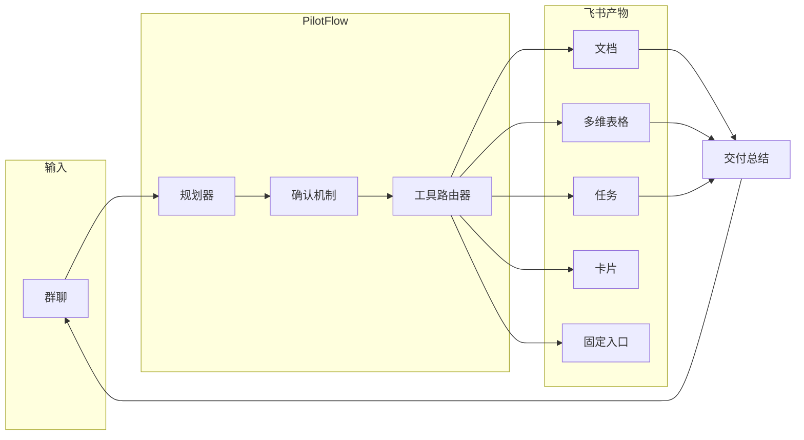

<div align="center">

# ✈️ PilotFlow

**飞书项目协作的 AI 运行层**

从群聊讨论开始，把目标、负责人、风险和材料推进成确认过的计划、可执行任务、可追踪状态和交付总结。

[English Version](README_EN.md)

[](#-飞书原生能力)
[](#-产品体验)
[](docs/OPERATOR_RUNBOOK.md)
[](https://github.com/DeliciousBuding/PilotFlow/stargazers)
[](https://github.com/DeliciousBuding/PilotFlow/commits/main)

[产品规格](docs/PRODUCT_SPEC.md) · [架构设计](docs/ARCHITECTURE.md) · [路线图](docs/ROADMAP.md) · [操作手册](docs/OPERATOR_RUNBOOK.md) · [文档索引](docs/README.md)

</div>

## 产品定位

PilotFlow 是面向飞书协作场景的 **AI 项目运行官**。

> **像一个项目经理一样，在飞书群里推动团队从讨论走向交付。**

项目讨论散落在群聊中，关键信息容易丢失。PilotFlow 让 Agent 理解讨论、生成计划、请求确认、调用飞书工具，把结果沉淀到文档、多维表格和任务中。

产品体验在飞书群聊、卡片、文档和任务系统中发生。

> **Agent 主驾驶，GUI 做仪表盘，人类始终掌舵。**

## 核心能力

PilotFlow 从群聊中的一句话需求出发，走完这条闭环：

1. 提取目标、负责人、截止时间、交付物和风险
2. 生成结构化项目执行计划，以飞书卡片形式发送到群中
3. 等待人工确认，当前主路径为 `确认执行`
4. 确认后自动创建飞书文档、多维表格状态记录、飞书任务
5. 发送风险裁决卡、部署项目入口消息并固定到群顶部
6. 汇总所有产物链接，发送交付总结到群聊

每一步都记录在 JSONL 运行日志中，支持 Flight Recorder 可视化回放。

## 当前状态

| 已验证 | 仍在收口 |
| --- | --- |
| Doc、Base、Task、IM、卡片发送、固定入口、风险卡、运行日志 | 卡片确认驱动 pending run 续跑、稳定演示录屏、配置截图 |

PilotFlow 现在是强工程原型。它已经能创建真实飞书产物，但还不是生产机器人。

## AI 的关键作用

PilotFlow 的 AI 驱动整个飞书工作流，不只是生成文字。

| 环节 | AI 做什么 | 飞书产出 |
| --- | --- | --- |
| 理解意图 | 从群聊文本中提取目标、成员、交付物、截止时间、风险 | 结构化项目数据 |
| 生成计划 | 拆解为可执行步骤，分配负责人和截止时间 | 执行计划卡片 |
| 风险检测 | 识别负责人缺失、截止时间模糊、交付物不完整等风险 | 风险裁决卡 |
| 工具路由 | 根据计划自动选择飞书工具并按序执行 | 文档、表格、任务 |
| 全程记录 | 记录每个工具调用、产物、降级和异常 | JSONL 运行日志 |

PilotFlow 采用 **Agent 架构 + 工具注册表 + 确认门控 + 运行追溯** 四层设计，可扩展、可审计。

技术要点：结构化提取引擎从群聊文本中解析目标、成员、交付物等字段；工具注册表统一管理 9 个飞书工具的调用、权限校验和幂等保护；编排器按计划有序执行工具调用，遇到失败自动降级并记录；Agent 循环带迭代上限，防止失控。详细架构见 [docs/ARCHITECTURE.md](docs/ARCHITECTURE.md)。

## 效率对比

以"启动一个新项目空间"为例：

| 步骤 | 手动操作 | PilotFlow |
| --- | --- | --- |
| 整理讨论要点 | 人工翻聊天记录 | 自动提取结构化要点 |
| 写项目文档 | 打开文档编辑 | 自动生成项目 Brief |
| 建多维表格状态 | 手动建表、填字段 | 自动写入项目状态 |
| 创建任务 | 逐个创建、分配负责人 | 按计划创建行动项 |
| 项目入口 | 手动整理链接并发群 | 自动发送入口并固定 |
| 记录过程 | 不记录或手动截图 | 自动生成可回放日志 |
| **合计** | **多工具切换，容易遗漏** | **一次确认后自动执行，有记录** |

## 差异化

飞书生态中已有多种 AI 能力，PilotFlow 的定位是**群聊原生的项目运行产品层**：

| 维度 | OpenClaw（飞书官方 Agent 插件） | 飞书妙记 / 飞书项目 | PilotFlow |
| --- | --- | --- | --- |
| 定位 | 通用 Agent 基础设施，解决"AI 怎么接入飞书" | 会议纪要 / 项目空间管理 | 群聊里的 AI 项目运行官 |
| 入口 | 个人助手，官方建议不接入群聊 | 会议 / 项目工作台 | 飞书群聊 |
| 工作流 | 通用 flow 编排，用户自己搭 | 会议→待办 / 项目流程 | 内置"讨论→计划→确认→执行→追溯"闭环 |
| 确认机制 | 底层 exec approvals，防 shell 风险 | 无 | 项目语义级审批，先预览再确认 |
| 运行追溯 | 工程级 trace，给开发者看 | 无 | 业务级审计：谁发起、确认了什么、写入了哪些对象 |

核心论点：**底层工具接入会越来越商品化，PilotFlow 的价值不在工具接入，在项目运行产品化。** Agent 架构 + 工具注册表设计，任何团队可以扩展新工具接入。

## 适用团队

| 团队类型 | 典型场景 | 为什么适合 |
| --- | --- | --- |
| 学生团队 | 把头脑风暴转化为可交付计划 | 轻量高效，适合快速项目周期 |
| 产品与运营 | 将群聊决策沉淀为文档、任务和状态 | 在决策发生的飞书环境中直接工作 |
| 黑客松团队 | 对齐范围、负责人和演示素材 | 一条可见的项目主线，无需重型项目管理 |
| AI 原生团队 | 让 Agent 在护栏内执行真实协作工作 | 确认机制和运行记录让自动化可解释、可审计 |

## 产品体验


## 运行模型

| 步骤 | 产品行为 | 控制点 |
| --- | --- | --- |
| 观察 | 读取群聊，提取目标、成员、交付物、截止时间和风险 | 无写入副作用 |
| 计划 | 生成结构化项目执行计划 | Schema 格式校验 |
| 确认 | 请求人工确认，非确认动作只记录不执行 | 不确认不执行 |
| 执行 | 通过飞书工具路由器创建产物 | 写入前预检，防重复创建 |
| 记录 | 记录每一步的工具调用、产物、降级和异常 | JSONL 运行日志 + Flight Recorder |
| 汇报 | 汇总产物链接，发送交付总结到群聊 | 带产物感知的总结消息 |

---

## 架构设计



详细架构：[docs/ARCHITECTURE.md](docs/ARCHITECTURE.md)。

## 飞书原生能力

全部使用真实飞书 API，经过实际环境验证：

| 能力 | 产品角色 |
| --- | --- |
| 群聊消息 | 项目发起和交付总结回传通道 |
| 互动卡片 | 执行计划展示、确认交互和风险裁决 |
| 飞书文档 | 自动生成项目 Brief 和交付文档 |
| 多维表格 | 结构化项目状态：负责人、截止时间、风险等级、状态、链接 |
| 飞书任务 | 行动项，支持负责人分配 |
| 固定入口消息 | 群内稳定的项目导航入口 |

## 路线图

| 阶段 | 目标 | 状态 |
| --- | --- | --- |
| Phase 0 | CLI、飞书 API 验证、本地骨架 | 已完成 |
| Phase 1 | 文档、多维表格、任务、消息、运行日志完整闭环 | 已完成 |
| Phase 2 | 计划卡、风险卡、入口消息、负责人映射、重复运行保护 | 基本完成 |
| Phase 3 | 演示加固、录屏、提交材料 | 进行中 |
| Phase 4 | 移动端确认、项目记忆、Worker 预览 | 计划中 |
| Phase 5 | 事件订阅、多项目空间、自我进化闭环 | 计划中 |

完整路线图：[docs/ROADMAP.md](docs/ROADMAP.md)。

## 文档

| 文档 | 说明 |
| --- | --- |
| [文档索引](docs/README.md) | 完整文档地图 |
| [项目简报](docs/PROJECT_BRIEF.md) | 产品与赛事简报 |
| [产品规格](docs/PRODUCT_SPEC.md) | 用户承诺、功能分级、非目标 |
| [架构设计](docs/ARCHITECTURE.md) | 组件、状态模型、工具路由 |
| [Agent 进化](docs/AGENT_EVOLUTION.md) | 自我进化、评估闭环与 Worker 编排 |
| [项目结构](docs/PROJECT_STRUCTURE.md) | 运行层、命令入口、目录边界 |
| [操作手册](docs/OPERATOR_RUNBOOK.md) | 本地操作、live run、证据生成 |
| [开发指南](docs/DEVELOPMENT.md) | 贡献流程、模块边界、验证矩阵 |
| [视觉设计](docs/VISUAL_DESIGN.md) | 飞书原生卡片、驾驶舱、UX 规则 |
| [路线图](docs/ROADMAP.md) | 长期规划和近期行动 |
| [演示材料](docs/demo/README.md) | 演示脚本、录屏指南、失败路径 |
| [真实状态](docs/PRODUCT_REALITY_CHECK.md) | 能力评估与声明边界 |

## 快速开始

```bash
# 安装依赖并验证环境
npm install
npm run pilot:check

# 运行产品闭环（dry-run 模式）
npm run pilot:run -- --dry-run

# 自定义输入运行
npm run pilot:run -- --dry-run --input "目标: 建立答辩项目空间 成员: 产品, 技术 交付物: Brief, Task 截止时间: 2026-05-03"
```

<details>
<summary>完整命令参考</summary>

```bash
# 环境验证
npm run pilot:check
npm run pilot:doctor
npm test

# 产品闭环
npm run pilot:run -- --dry-run
npm run pilot:gateway -- --dry-run --timeout 30s --max-events 1
npm run pilot:agent-smoke

# 演示与证据
npm run pilot:recorder -- --input tmp/runs/latest-manual-run.jsonl --output tmp/flight-recorder/latest.html
npm run pilot:package
npm run pilot:status
npm run pilot:audit
```

操作手册：[docs/OPERATOR_RUNBOOK.md](docs/OPERATOR_RUNBOOK.md)。开发指南：[docs/DEVELOPMENT.md](docs/DEVELOPMENT.md)。

</details>

## 安全原则

- 发布项目产物前必须经过人工确认。
- 工具失败会被记录和展示，Agent 不会假装失败的写入成功了。
- 每条写入路径都设计了幂等或重复检测机制。
- 密钥不允许出现在仓库、公开文档、截图或聊天记录中。

## Star History

[](https://star-history.com/#DeliciousBuding/PilotFlow&Date)

## 参与贡献

变更应保持主循环稳定：

```text
群聊 -> 执行计划 -> 确认 -> 飞书工具 -> 状态 -> 风险裁决 -> 交付总结
```

1. 运行相关验证。
2. 更新受影响的文档。
3. 不要将本地密钥提交到仓库。

## 致谢

- 飞书 / Lark 开放平台和 `lark-cli`。
- 飞书 AI 校园挑战赛赛事材料和赛题说明。
- 影响了 Worker 产物路线的 Agent 工程工具。
