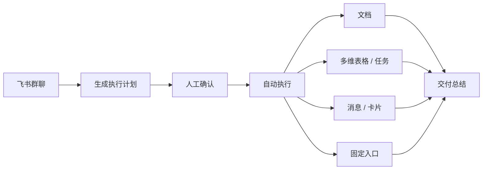
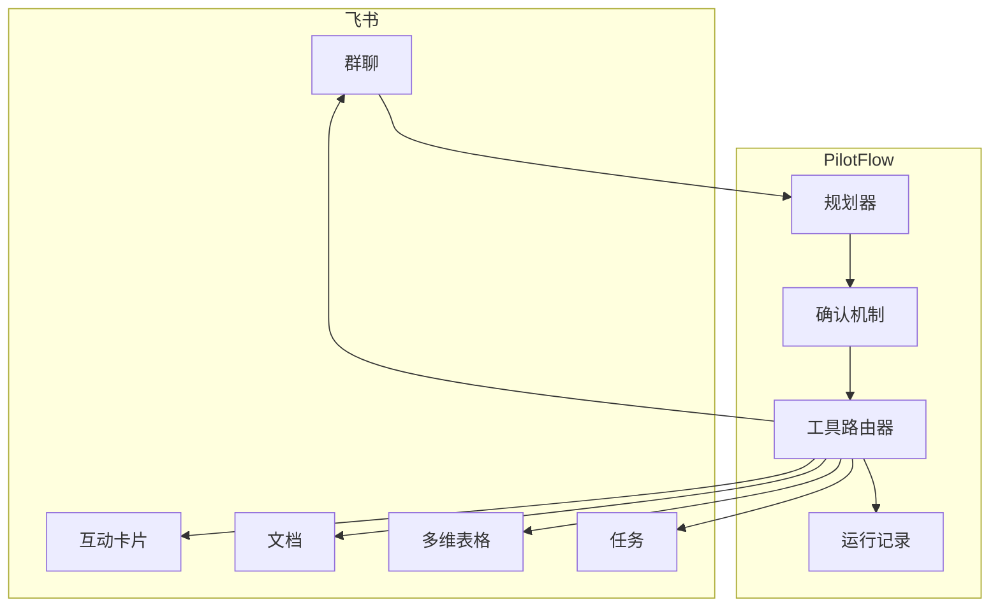

<div align="center">

# ✈️ PilotFlow

**飞书群里的 AI 项目运行官**

群里聊完就出计划，确认后自动建文档、建任务、记状态，结果回到群里。

[English Version](README_EN.md)

[](#-飞书原生能力)
[](#-产品体验)
[](docs/OPERATOR_RUNBOOK.md)
[](https://github.com/DeliciousBuding/pilot-flow/stargazers)
[](https://github.com/DeliciousBuding/pilot-flow/commits/main)

[产品规格](docs/PRODUCT_SPEC.md) · [架构设计](docs/ARCHITECTURE.md) · [路线图](docs/ROADMAP.md) · [操作手册](docs/OPERATOR_RUNBOOK.md) · [文档索引](docs/README.md)

</div>

---

> **截图占位**：飞书群聊中 PilotFlow 发送执行计划卡片的效果截图。

---

## PilotFlow 做什么

项目讨论经常在群里聊完就散了——谁负责、什么时候交、有什么风险，都没落地。PilotFlow 就是来解决这个问题的。

它跑在飞书群里，你用自然语言说一句项目需求，它会：

1. 从你的话里提取目标、负责人、截止时间、交付物和风险
2. 生成一份结构化的项目执行计划发到群里
3. 等你确认后，自动创建飞书文档、多维表格状态、任务
4. 把结果汇总发回群里，入口消息固定在群顶部

全程每一步都有记录，出了问题也知道哪一步出了问题。

> **Agent 开车，人踩刹车。**

## 谁在用

| 团队 | 场景 | 为什么合适 |
| --- | --- | --- |
| 学生团队 | 头脑风暴到可交付 | 轻量，适合快节奏项目 |
| 产品运营 | 群聊决策变成文档和任务 | 在飞书里直接干活，不用换工具 |
| 黑客松团队 | 对齐范围和负责人 | 一条主线拉通，不用装重型项目管理 |
| AI 团队 | 让 Agent 干真活 | 有确认、有记录，自动化不会失控 |

## 产品体验



## 运行模型

| 步骤 | 做什么 | 安全机制 |
| --- | --- | --- |
| 观察 | 读群聊，提取目标、成员、交付物、截止时间、风险 | 不写入任何东西 |
| 计划 | 生成结构化执行计划 | 先校验格式再往下走 |
| 确认 | 等人批准、编辑或取消 | 不确认不执行 |
| 执行 | 通过飞书工具路由器创建产物 | 写入前预检，防重复创建 |
| 记录 | 每一步都记日志 | JSONL 日志 + 可视化回放 |
| 汇报 | 汇总结果发回群里 | 带产物链接的总结 |

> **截图占位**：产品运行后生成的飞书文档、多维表格状态和任务截图。

---

## 架构设计



详细架构：[docs/ARCHITECTURE.md](docs/ARCHITECTURE.md)。

## 飞书原生能力

全部用真实飞书 API，不是模拟数据：

| 能力 | 干什么 |
| --- | --- |
| 群聊消息 | 项目发起和结果回传 |
| 互动卡片 | 展示计划、确认交互、风险裁决 |
| 飞书文档 | 自动生成项目 Brief |
| 多维表格 | 记录负责人、截止时间、风险、状态 |
| 飞书任务 | 行动项，支持分配负责人 |
| 固定入口 | 群内稳定的项目导航 |

> **截图占位**：飞书互动卡片确认截图和运行过程追溯 HTML 视图截图。

## 路线图

| 阶段 | 目标 | 状态 |
| --- | --- | --- |
| Phase 0 | CLI、飞书 API 验证、本地骨架 | 已完成 |
| Phase 1 | 文档、多维表格、任务、消息、运行日志闭环 | 已完成 |
| Phase 2 | 计划卡、风险卡、入口消息、负责人映射、防重复 | 已完成 |
| Phase 3 | 演示加固、录屏、提交材料 | 进行中 |
| Phase 4 | 移动端确认、项目记忆、Worker 预览 | 计划中 |
| Phase 5 | 事件订阅、多项目空间、自我进化 | 计划中 |

完整路线图：[docs/ROADMAP.md](docs/ROADMAP.md)。

## 文档

| 文档 | 说明 |
| --- | --- |
| [文档索引](docs/README.md) | 完整文档地图 |
| [项目简报](docs/PROJECT_BRIEF.md) | 产品与赛事简报 |
| [产品规格](docs/PRODUCT_SPEC.md) | 用户承诺、功能分级 |
| [架构设计](docs/ARCHITECTURE.md) | 组件、状态模型、工具路由 |
| [项目结构](docs/PROJECT_STRUCTURE.md) | 运行层、命令入口、目录边界 |
| [操作手册](docs/OPERATOR_RUNBOOK.md) | 本地操作、live run、证据生成 |
| [开发指南](docs/DEVELOPMENT.md) | 贡献流程、模块边界 |
| [视觉设计](docs/VISUAL_DESIGN.md) | 飞书原生卡片、UX 规则 |
| [路线图](docs/ROADMAP.md) | 长期规划和近期行动 |
| [演示材料](docs/demo/README.md) | 演示脚本、录屏指南、失败路径 |
| [真实状态](docs/PRODUCT_REALITY_CHECK.md) | 能力评估与声明边界 |

## 快速开始

```bash
npm install
npm run pilot:check

# dry-run 跑一遍产品闭环
npm run pilot:run -- --dry-run

# 带自定义输入
npm run pilot:run -- --dry-run --input "目标: 建立答辩项目空间 成员: 产品, 技术 交付物: Brief, Task 截止时间: 2026-05-03"
```

<details>
<summary>完整命令</summary>

```bash
# 环境检查
npm run pilot:check
npm run pilot:doctor
npm test

# 产品闭环
npm run pilot:run -- --dry-run
npm run pilot:gateway -- --dry-run --max-events 1

# 演示和证据
npm run pilot:recorder -- --input tmp/runs/latest-manual-run.jsonl --output tmp/flight-recorder/latest.html
npm run pilot:package
npm run pilot:status
npm run pilot:audit
```

操作手册：[docs/OPERATOR_RUNBOOK.md](docs/OPERATOR_RUNBOOK.md)。

</details>

## 安全原则

- 发布产物前必须确认。
- 工具失败会记录，不会假装成功。
- 每条写入路径都有幂等或防重复机制。
- 密钥不进仓库、不进文档、不进截图。

## Star History

[](https://star-history.com/#DeliciousBuding/pilot-flow&Date)

## 致谢

- 飞书 / Lark 开放平台和 `lark-cli`。
- 飞书 AI 校园挑战赛。
