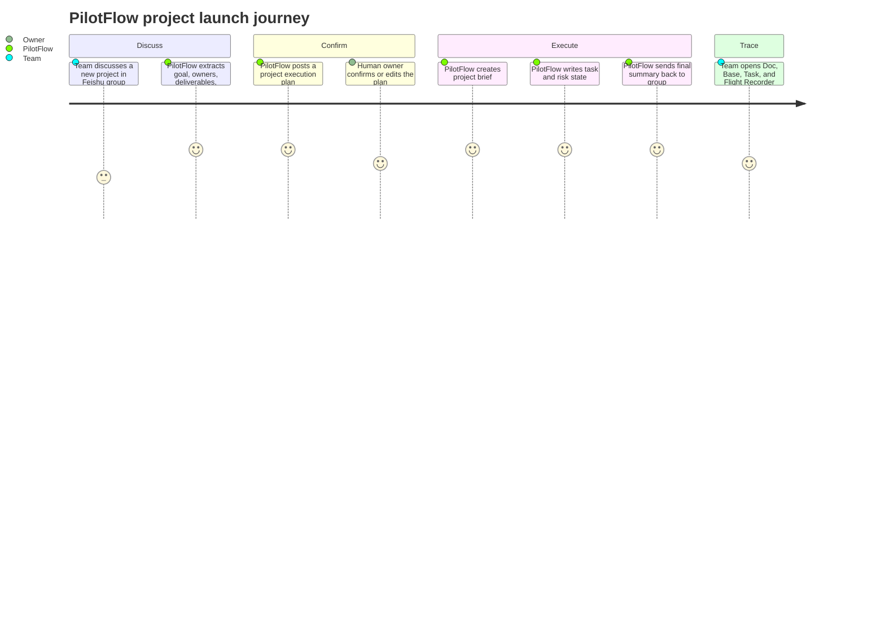
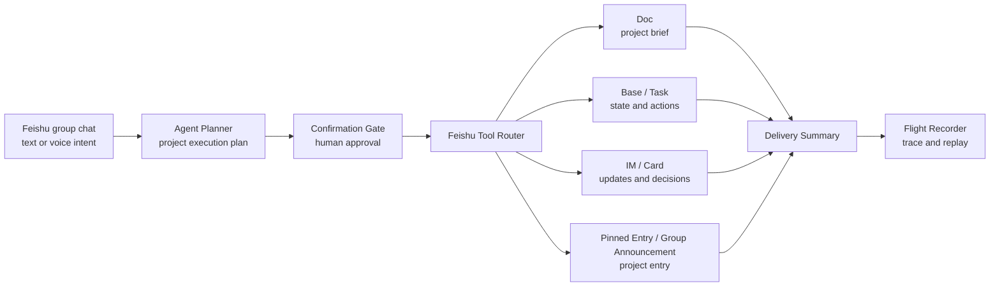
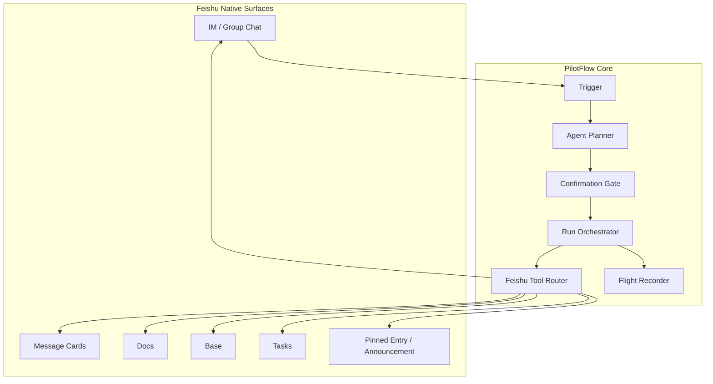
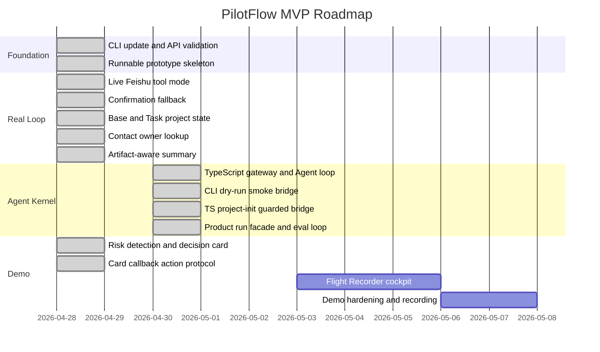

<div align="center">

# ✈️ PilotFlow

**飞书项目协作的 AI 运行层**<br/>
**An AI operating layer for Feishu project work**

从群聊讨论开始，把目标、负责人、风险和材料推进成确认过的计划、可执行任务、可追踪状态和交付总结。<br/>
Start from group-chat discussion and turn intent into confirmed plans, executable tasks, traceable state, and delivery summaries.

[](#-mvp-progress)
[](#-feishu-native-surfaces)
[](#-product-experience)
[](docs/OPERATOR_RUNBOOK.md)
[](docs/OPERATOR_RUNBOOK.md)
[](https://github.com/DeliciousBuding/pilot-flow/stargazers)
[](https://github.com/DeliciousBuding/pilot-flow/commits/main)

[Product Spec](docs/PRODUCT_SPEC.md) · [Reality Check](docs/PRODUCT_REALITY_CHECK.md) · [Architecture](docs/ARCHITECTURE.md) · [Agent Evolution](docs/AGENT_EVOLUTION.md) · [Operator Runbook](docs/OPERATOR_RUNBOOK.md) · [Roadmap](docs/ROADMAP.md) · [Docs](docs/README.md)

| Stage | Primary surface | Current focus |
| --- | --- | --- |
| Strong prototype | Feishu IM + Cards + Doc + Base + Task | TS live proof, real callback delivery, capture materials |

</div>

---

## 📖 Table of Contents

- [📌 中文](#-中文)
- [🌍 English](#-english)
- [🎯 Why PilotFlow](#-why-pilotflow)
- [👥 Who It Is For](#-who-it-is-for)
- [🧭 Product Experience](#-product-experience)
- [🛫 Operating Model](#-operating-model)
- [🔁 Product Loop](#-product-loop)
- [🧠 Architecture](#-architecture)
- [🧱 Product-Grade Foundations](#-product-grade-foundations)
- [🧬 Agent Evolution](#-agent-evolution)
- [🧩 Feishu-Native Surfaces](#-feishu-native-surfaces)
- [🧪 MVP Progress](#-mvp-progress)
- [🧾 Reality Check](#-reality-check)
- [🗺️ Roadmap Snapshot](#-roadmap-snapshot)
- [📚 Documentation](#-documentation)
- [⚡ Prototype Demo](#-prototype-demo)
- [🛡️ Trust Model](#-trust-model)
- [🔐 Safety Principles](#-safety-principles)
- [📈 Star History](#-star-history)
- [🤝 Contributing](#-contributing)
- [🙏 Acknowledgments](#-acknowledgments)

## 📌 中文

PilotFlow 不是普通聊天机器人，不是文档生成器，也不是只面向程序员的代码 Agent。它的产品定位是一个面向飞书协作场景的 **AI 项目运行官**：

> **像一个项目经理一样，在飞书群里推动团队从讨论走向交付。**

在真实协作里，项目的关键信息经常散落在群聊中：目标、负责人、截止时间、风险、材料、确认意见、临时承诺。PilotFlow 让 AI Agent 成为主驾驶，负责理解讨论、生成项目执行计划、请求人类确认、调用飞书原生工具，并把结果沉淀到 Doc、Base、Task、群入口消息和总结消息中。

GUI 或 Chat Tab 不是主流程，它只是仪表盘和辅助操作台。真正的产品体验应该发生在团队已经工作的地方：**飞书 IM、卡片、文档、多维表格和任务系统**。

## 🌍 English

PilotFlow is a Feishu-native AI operating layer for project work. It lives inside the collaboration flow, understands project intent, proposes an execution plan, asks for human confirmation, executes through Feishu tools, records every step, and sends a delivery summary back to the team.

The product principle is simple:

> **Agent as Pilot. GUI as cockpit. Humans stay in control.**

PilotFlow is designed for practical team operations first: fewer lost decisions, fewer forgotten tasks, clearer project state, and a traceable AI workflow that fits Feishu instead of replacing it.

## 🎯 Why PilotFlow

| Team pain | PilotFlow response | Feishu-native output |
| --- | --- | --- |
| Discussion is scattered across group messages | Extract goals, members, deadlines, deliverables, and risks | Project execution plan |
| Verbal agreement is hard to track | Ask for explicit confirmation before side effects | Card or text confirmation |
| Tasks and risks disappear in chat history | Write structured project state | Base records and Tasks |
| Project entry points are hard to find | Publish a stable project entry | Pinned entry message or group announcement |
| AI actions are hard to trust | Record plans, tool calls, artifacts, fallbacks, and errors | Flight Recorder |

## 👥 Who It Is For

| Team type | Typical job | Why PilotFlow fits |
| --- | --- | --- |
| Student competition teams | Turn brainstorming into a deliverable plan | Lightweight enough for fast project cycles, traceable enough for review |
| Product and operations groups | Convert group decisions into documents, tasks, and status | Works inside Feishu where decisions already happen |
| Hackathon or prototype teams | Keep scope, owners, risks, and demo assets aligned | Gives one visible project spine without a heavy PM tool |
| AI-native teams | Let agents perform real collaboration work with guardrails | Confirmation, idempotency, and run traces keep automation explainable |

PilotFlow is not limited to campus projects. The current prototype uses a competition scenario because it is concrete and easy to evaluate, but the product model is a general Feishu-native project operations assistant.

## 🧭 Product Experience



## 🛫 Operating Model

PilotFlow turns a vague group discussion into a managed project run:

| Step | Product behavior | Control point |
| --- | --- | --- |
| Observe | Read the incoming project intent and extract goal, members, deliverables, deadline, and risks | No write side effects |
| Plan | Generate a structured project execution plan | Schema validation before execution |
| Confirm | Ask a human to approve, edit, restrict to doc-only, or cancel | Confirmation gate |
| Execute | Create Feishu-native artifacts through a tool router | Preflight checks and duplicate-run guard |
| Record | Capture every step, tool call, artifact, fallback, and error | JSONL run log and Flight Recorder |
| Report | Send the final summary back to the group | Artifact-aware summary |

## 🔁 Product Loop



## 🧠 Architecture



Detailed architecture: [docs/ARCHITECTURE.md](docs/ARCHITECTURE.md).

## 🧱 Product-Grade Foundations

PilotFlow is still an MVP prototype, but it is packaged around product-grade foundations rather than a one-off script:

| Foundation | Current implementation |
| --- | --- |
| Native surface strategy | IM, Cards, Docs, Base, Task, pinned entry, and optional announcement path |
| Human control | Text confirmation fallback and card action protocol before side effects |
| Run safety | Live preflight, duplicate-run guard, short idempotency keys, unsafe-plan fallback |
| Traceability | JSONL run log, artifact normalizer, generated review packs, local Flight Recorder |
| Failure handling | Tool failures are recorded; announcement and callback edges have explicit fallback stories |
| Packaging | Product README, product spec, architecture, operator runbook, development guide, demo kit |

## 🧬 Agent Evolution

PilotFlow has adopted selected Hermes-style runtime patterns: Agent loop, ToolRegistry, Feishu gateway, session queues, error classification, retry, hermetic tests, and trace-first operation. This is not a claim that PilotFlow is already a mature autonomous agent platform. The next product layer is controlled self-evolution:

```text
Run trace -> Evaluation -> Improvement proposal -> Human approval -> Updated workflow/template/test
```

Multi-agent work is planned as a manager-worker model, not uncontrolled parallel autonomy. The Pilot remains accountable; workers produce preview artifacts for documents, tables, research, scripts, or review, and Feishu writes still go through confirmation.

Detailed plan: [docs/AGENT_EVOLUTION.md](docs/AGENT_EVOLUTION.md).

## 🧩 Feishu-Native Surfaces

| Surface | Product role | Current maturity |
| --- | --- | --- |
| IM | Main collaboration entry and summary channel | Live send validated; automatic group trigger pending |
| Cards | Execution plan, confirmation, risk decision | Live send validated; real button callback pending |
| Docs | Project brief and delivery documents | Live creation validated |
| Base | Tasks, detected risks, artifacts, confirmations | Live Project State write validated |
| Task | Concrete owner/deadline action items | Live creation validated; assignee mapping remains guarded |
| Pinned Entry / Announcement | Stable project entrance | Pinned entry validated; native announcement falls back on current docx API block |
| Event subscription | Card callback listener first, `@PilotFlow` automatic trigger later | Local listener bridge ready; platform callback proof pending |
| Chat Tab / H5 | Lightweight cockpit and flight recorder | Static recorder prototype |
| Whiteboard / Calendar / Slides | Demo enhancement surfaces | Later |

## 🧪 MVP Progress

PilotFlow is currently a **strong engineering prototype**, not a finished product. The first deliverable is a reliable Feishu-native project launch loop, not a separate project-management SaaS and not an unattended production bot.

| Capability | Maturity | Boundary |
| --- | --- | --- |
| Activity tenant, `lark-cli`, and core Feishu API proof | Live validated | Real IM/Card/Doc/Base/Task paths have been exercised. |
| JS project-launch live path | Live validated prototype | It can create visible Feishu artifacts and a run trace from a confirmed local command. |
| TypeScript `pilot:run` path | Dry-run ready, live pending | Product facade exists; real live parity is the next hard gate. |
| Execution plan card and risk card | Live send validated | Button payloads exist, but real callback execution is not proven. |
| Card callback listener bridge | Local/prototype | Parser, listener, and trigger bridge are tested; no real callback event has reached the listener yet. |
| Pinned project entry | Live validated | This is the reliable project entrance in the current prototype. |
| Group announcement | Attempted fallback | Current test group returns a docx announcement API block, so do not claim native announcement success. |
| Base/Task state | Live validated prototype | Owner mapping and Contacts lookup are guarded; text fallback remains important. |
| Flight Recorder and review packs | Implemented support tooling | Useful for trust and evaluation, but not the product itself. |
| LLM Agent loop | Scaffolding with tests | Real product planning through a model is not a current claim. |
| Hermes-style self-evolution | Review loop only | Retrospective/eval/worker preview can propose improvements; no hidden self-modification. |
| Multi-worker orchestration | Contract seed | First Review Worker is preview-only; broader workers and approval cards are future work. |

Full hard-status page: [docs/PRODUCT_REALITY_CHECK.md](docs/PRODUCT_REALITY_CHECK.md).

## 🧾 Reality Check

PilotFlow is useful because it has a real Feishu-native product spine: plan, confirmation, Feishu artifacts, project state, risk surface, summary, and trace. It is not complete because normal users still cannot rely on a fully automatic group bot, real card callback delivery is pending, and the TypeScript product path still needs live validation before it replaces the older JS live path.

The next milestone is therefore not another documentation pack. It is live proof of `pilot:run`, callback delivery proof, and a cleaner Feishu IM trigger path.

## 🗺️ Roadmap Snapshot



Full roadmap: [docs/ROADMAP.md](docs/ROADMAP.md).

## 📚 Documentation

| Document | Purpose |
| --- | --- |
| [Docs Index](docs/README.md) | Complete documentation map |
| [Project Brief](docs/PROJECT_BRIEF.md) | Product and competition brief |
| [Product Spec](docs/PRODUCT_SPEC.md) | User promise, feature tiers, non-goals |
| [Architecture](docs/ARCHITECTURE.md) | Components, state model, tool routing |
| [Agent Evolution](docs/AGENT_EVOLUTION.md) | Hermes-inspired self-evolution, memory, evaluation, and worker orchestration |
| [Project Structure](docs/PROJECT_STRUCTURE.md) | Runtime layers, command surface, and placement rules |
| [Operator Runbook](docs/OPERATOR_RUNBOOK.md) | Local operation, live run, evidence regeneration, troubleshooting |
| [Development Guide](docs/DEVELOPMENT.md) | Contributor workflow, module boundaries, validation matrix |
| [Visual Design](docs/VISUAL_DESIGN.md) | Feishu-native cards, cockpit, UX rules |
| [Roadmap](docs/ROADMAP.md) | Long-term plan and immediate next actions |
| [Demo Kit](docs/demo/README.md) | Demo playbook, capture guide, fallback notes, and review-pack workflow |
| [Demo Capture Guide](docs/demo/CAPTURE_GUIDE.md) | Recording and screenshot checklist |
| [Failure Paths](docs/demo/FAILURE_PATHS.md) | Fallback behavior, known platform limits, Q&A boundaries, and no-network explanation |
| [Documentation Plan](docs/DOCUMENTATION_PLAN.md) | Documentation governance |

## ⚡ Prototype Demo

For local development and reviewer reproduction:

```bash
npm run pilot:check
npm test
npm run pilot:run -- --dry-run
npm run pilot:agent-smoke
npm run pilot:project-init-ts
npm run pilot:run -- --dry-run --input "目标: 建立答辩项目空间 成员: 产品, 技术 交付物: Brief, Task 截止时间: 2026-05-03"
npm run pilot:project-init-ts -- --dry-run --send-entry-message --send-risk-card
npm run pilot:recorder -- --input tmp/runs/latest-manual-run.jsonl --output tmp/flight-recorder/latest.html
npm run review:retrospective-eval
npm run pilot:package
npm run pilot:status
npm run pilot:audit
```

`pilot:run` is the preferred product-facing local entry. It uses the TypeScript project-init path, forces dry-run unless live mode is explicit, enables the execution-plan card, project entry message, pinned entry, and risk card by default for dry-run or confirmed live runs, and writes to `tmp/runs/latest-manual-run.jsonl` or `tmp/runs/latest-live-run.jsonl` unless an output path is supplied. Live Feishu execution is still behind explicit confirmation. Operational setup lives in [docs/OPERATOR_RUNBOOK.md](docs/OPERATOR_RUNBOOK.md); contributor workflow lives in [docs/DEVELOPMENT.md](docs/DEVELOPMENT.md). Generated review packs, including the Run Retrospective Pack and Retrospective Eval report, are auxiliary material and are kept out of the product runtime surface.

## 🛡️ Trust Model

| Question | PilotFlow answer |
| --- | --- |
| Can the agent write to Feishu without approval? | No. The live write path requires explicit confirmation. |
| Can a failed tool call look successful? | It should not. Tool errors are recorded and surfaced as run events and fallback artifacts. |
| Can the same demo accidentally create duplicate artifacts? | Live runs are guarded by a duplicate-run key unless the operator explicitly bypasses it. |
| Can reviewers inspect what happened? | Yes. Run logs, generated review packs, Flight Recorder, retrospective reports, and final summaries expose the execution path. |
| Can worker agents publish on their own? | No. The first Review Worker returns preview artifacts and proposed Feishu writes only; publishing remains confirmation-gated. |
| Is the current prototype production-ready? | No. It is a strong engineering prototype with known pending work around TS live parity, real card callback delivery, automatic IM trigger, and manual capture evidence. |

## 🔐 Safety Principles

- Human confirmation is required before publishing project artifacts.
- Tool failures must be recorded and surfaced.
- The Agent must not pretend a failed Feishu write succeeded.
- Every write path should be designed for idempotency or duplicate detection.
- Live project-init runs are guarded against accidental duplicate Feishu writes unless explicitly bypassed.
- Secrets never belong in the repository, public docs, screenshots, or chat logs.
- Official Feishu reference caches stay outside this repo.

## 📈 Star History

[](https://star-history.com/#DeliciousBuding/pilot-flow&Date)

## 🤝 Contributing

PilotFlow is moving quickly toward a competition MVP. Changes should keep the main loop stable:

```text
Group chat -> Execution plan -> Confirmation -> Feishu tools -> State -> Risk decision -> Delivery summary
```

Before opening a change:

1. Run the relevant validation.
2. Update the affected docs.
3. Keep official reference caches and local secrets out of the repo.

## 🙏 Acknowledgments

- Feishu / Lark Open Platform and `lark-cli`.
- Feishu AI Campus Challenge materials and challenge brief.
- Agent engineering tools that influenced the worker-artifact roadmap.
