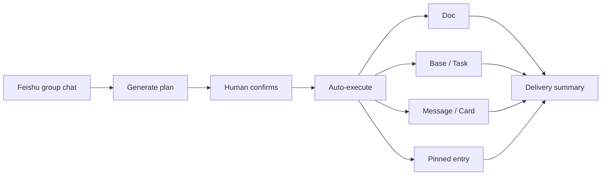
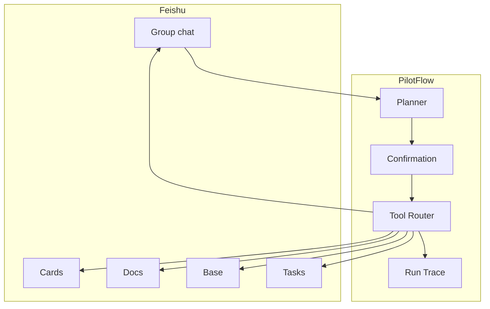

<div align="center">

# ✈️ PilotFlow

**AI project operations officer for Feishu group chats**

Discuss in chat, get a plan, confirm once — docs, tasks, and status are created automatically.

[中文版](README.md)

[](#-feishu-native-capabilities)
[](#-product-experience)
[](docs/OPERATOR_RUNBOOK.md)
[](https://github.com/DeliciousBuding/pilot-flow/stargazers)
[](https://github.com/DeliciousBuding/pilot-flow/commits/main)

[Product Spec](docs/PRODUCT_SPEC.md) · [Architecture](docs/ARCHITECTURE.md) · [Roadmap](docs/ROADMAP.md) · [Operator Runbook](docs/OPERATOR_RUNBOOK.md) · [Docs](docs/README.md)

</div>

---

## What PilotFlow Does

Project discussions happen in group chats, but the decisions often get lost — who owns what, when it's due, what the risks are. PilotFlow fixes that.

It runs inside a Feishu group. You describe what you need in plain language, and it:

1. Extracts goals, owners, deadlines, deliverables, and risks
2. Generates a structured execution plan and posts it to the group
3. After you confirm, creates Feishu Docs, Base records, and Tasks
4. Sends a summary back to the group and pins the project entry

Every step is logged, so you always know what happened and where things went wrong.

> **Agent drives. Humans steer.**

## Who Uses It

| Team | Scenario | Why it fits |
| --- | --- | --- |
| Student teams | Brainstorm to deliverable | Lightweight, fits fast cycles |
| Product & ops | Turn chat decisions into docs and tasks | Works where decisions already happen |
| Hackathon teams | Align scope and owners | One spine, no heavy PM tool |
| AI teams | Let agents do real work | Confirmation and logs keep it safe |

## Product Experience



## How It Works

| Step | What happens | Safety |
| --- | --- | --- |
| Observe | Read the chat, extract intent | No writes |
| Plan | Generate structured execution plan | Schema validation first |
| Confirm | Wait for human approval | No confirm, no execute |
| Execute | Create Feishu artifacts via tool router | Preflight checks, duplicate guard |
| Record | Log every step | JSONL trace + visual replay |
| Report | Send summary to group | Includes artifact links |

## Architecture



Detailed architecture: [docs/ARCHITECTURE.md](docs/ARCHITECTURE.md).

## Feishu-Native Capabilities

All real Feishu APIs, no mock data:

| Capability | What it does |
| --- | --- |
| Group messages | Project initiation and summary delivery |
| Interactive cards | Plan display, confirmation, risk decisions |
| Feishu Docs | Auto-generated project brief |
| Base | Structured state: owner, deadline, risk, status |
| Tasks | Action items with optional assignee |
| Pinned entry | Stable project navigation in the group |

## Roadmap

| Phase | Goal | Status |
| --- | --- | --- |
| Phase 0 | CLI, Feishu API validation, local skeleton | Done |
| Phase 1 | Doc, Base, Task, IM, run log loop | Done |
| Phase 2 | Plan cards, risk cards, pinned entry, owner mapping | Done |
| Phase 3 | Demo hardening, recording, submission | In progress |
| Phase 4 | Mobile confirmation, memory, worker preview | Planned |
| Phase 5 | Event subscription, multi-project, self-evolution | Planned |

Full roadmap: [docs/ROADMAP.md](docs/ROADMAP.md).

## Documentation

| Document | Purpose |
| --- | --- |
| [Docs Index](docs/README.md) | Complete documentation map |
| [Project Brief](docs/PROJECT_BRIEF.md) | Product and competition brief |
| [Product Spec](docs/PRODUCT_SPEC.md) | User promise, feature tiers |
| [Architecture](docs/ARCHITECTURE.md) | Components, state model, tool routing |
| [Project Structure](docs/PROJECT_STRUCTURE.md) | Runtime layers, command surface |
| [Operator Runbook](docs/OPERATOR_RUNBOOK.md) | Local operation, live run, evidence |
| [Development Guide](docs/DEVELOPMENT.md) | Contributor workflow, module boundaries |
| [Visual Design](docs/VISUAL_DESIGN.md) | Feishu-native cards, UX rules |
| [Roadmap](docs/ROADMAP.md) | Long-term plan and next actions |
| [Demo Kit](docs/demo/README.md) | Demo playbook, capture guide, failure paths |
| [Reality Check](docs/PRODUCT_REALITY_CHECK.md) | Capability assessment and claim boundaries |

## Quick Start

```bash
npm install
npm run pilot:check

# Dry-run the product loop
npm run pilot:run -- --dry-run

# With custom input
npm run pilot:run -- --dry-run --input "目标: 建立答辩项目空间 成员: 产品, 技术 交付物: Brief, Task 截止时间: 2026-05-03"
```

<details>
<summary>All commands</summary>

```bash
# Environment
npm run pilot:check
npm run pilot:doctor
npm test

# Product loop
npm run pilot:run -- --dry-run
npm run pilot:gateway -- --dry-run --max-events 1

# Demo and evidence
npm run pilot:recorder -- --input tmp/runs/latest-manual-run.jsonl --output tmp/flight-recorder/latest.html
npm run pilot:package
npm run pilot:status
npm run pilot:audit
```

Operational setup: [docs/OPERATOR_RUNBOOK.md](docs/OPERATOR_RUNBOOK.md).

</details>

## Safety

- Confirmation required before any Feishu write.
- Failures are logged, never hidden.
- Every write path has idempotency or duplicate detection.
- Secrets stay out of the repo.

## Star History

[](https://star-history.com/#DeliciousBuding/pilot-flow&Date)

## Acknowledgments

- Feishu / Lark Open Platform and `lark-cli`.
- Feishu AI Campus Challenge.
