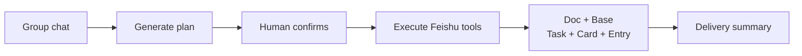
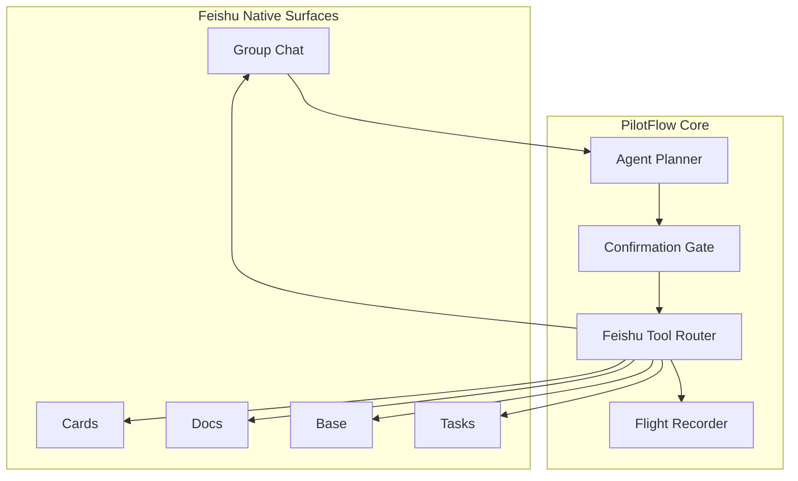

<div align="center">

# ✈️ PilotFlow

**An AI operating layer for Feishu project work**

Start from group-chat discussion and turn intent into confirmed plans, executable tasks, traceable state, and delivery summaries.

[中文版](README.md)

[](#-feishu-native-capabilities)
[](#-product-experience)
[](docs/OPERATOR_RUNBOOK.md)
[](https://github.com/DeliciousBuding/pilot-flow/stargazers)
[](https://github.com/DeliciousBuding/pilot-flow/commits/main)

[Product Spec](docs/PRODUCT_SPEC.md) · [Architecture](docs/ARCHITECTURE.md) · [Roadmap](docs/ROADMAP.md) · [Operator Runbook](docs/OPERATOR_RUNBOOK.md) · [Docs](docs/README.md)

</div>

---

## Product Positioning

PilotFlow is an **AI project operations officer** for Feishu collaboration:

> **Like a project manager that pushes teams from discussion to delivery — right inside the Feishu group chat.**

In real collaboration, key project signals are scattered across group messages: goals, owners, deadlines, risks, materials, and confirmations. PilotFlow lets an AI Agent act as the primary driver — understanding discussion, generating execution plans, requesting human confirmation, invoking Feishu-native tools, and writing results into Docs, Base, Tasks, pinned entries, and delivery summaries.

The product experience happens where teams already work: **Feishu IM, cards, documents, Base, and Tasks**.

> **Agent as Pilot. GUI as cockpit. Humans stay in control.**

## Core Capabilities

Starting from a single project requirement in the group chat, PilotFlow completes the full loop:

1. Extract goals, owners, deadlines, deliverables, and risks
2. Generate a structured execution plan and send it as a Feishu card
3. Wait for human confirmation — approve, edit, restrict to doc-only, or cancel
4. After confirmation, create Feishu Docs, Base state records, and Tasks
5. Send risk-decision cards, deploy a pinned project entry in the group
6. Aggregate all artifact links and send a delivery summary to the chat

Every step is logged in JSONL run logs with Flight Recorder visual replay support.

## Who Uses It

| Team type | Typical scenario | Why it fits |
| --- | --- | --- |
| Student teams | Brainstorming to deliverable plan | Lightweight, fits fast project cycles |
| Product and operations | Group decisions into docs and tasks | Works where decisions already happen |
| Hackathon teams | Align scope, owners, and demo assets | One visible project spine, no heavy PM tool |
| AI-native teams | Let agents do real collaboration work | Confirmation and run traces keep automation explainable |

## Product Experience



## Operating Model

| Step | Product behavior | Control point |
| --- | --- | --- |
| Observe | Read the chat, extract goal, members, deliverables, deadline, and risks | No write side effects |
| Plan | Generate a structured execution plan | Schema validation |
| Confirm | Request human approval, edit, or cancel | No confirm, no execute |
| Execute | Create Feishu artifacts via tool router | Preflight checks, duplicate guard |
| Record | Log every tool call, artifact, fallback, and error | JSONL run log + Flight Recorder |
| Report | Aggregate artifact links, send delivery summary | Artifact-aware summary |

## Architecture



Detailed architecture: [docs/ARCHITECTURE.md](docs/ARCHITECTURE.md).

## Feishu-Native Capabilities

All validated with real Feishu APIs, not mock data:

| Capability | Product role |
| --- | --- |
| Group messages | Project initiation and delivery-summary channel |
| Interactive cards | Execution-plan display, confirmation, risk decisions |
| Feishu Docs | Auto-generated project brief and delivery documents |
| Base | Structured project state: owner, deadline, risk level, status, links |
| Tasks | Action items with optional assignee mapping |
| Pinned entry | Stable project navigation in the group chat |

## Roadmap

| Phase | Goal | Status |
| --- | --- | --- |
| Phase 0 | CLI, Feishu API validation, local skeleton | Done |
| Phase 1 | Doc, Base, Task, IM, run log complete loop | Done |
| Phase 2 | Plan cards, risk cards, pinned entry, owner mapping, duplicate guard | Done |
| Phase 3 | Demo hardening, recording, submission materials | In progress |
| Phase 4 | Mobile confirmation, project memory, worker preview | Planned |
| Phase 5 | Event subscription, multi-project spaces, self-evolution | Planned |

Full roadmap: [docs/ROADMAP.md](docs/ROADMAP.md).

## Documentation

| Document | Purpose |
| --- | --- |
| [Docs Index](docs/README.md) | Complete documentation map |
| [Project Brief](docs/PROJECT_BRIEF.md) | Product and competition brief |
| [Product Spec](docs/PRODUCT_SPEC.md) | User promise, feature tiers, non-goals |
| [Architecture](docs/ARCHITECTURE.md) | Components, state model, tool routing |
| [Agent Evolution](docs/AGENT_EVOLUTION.md) | Self-evolution, evaluation, and worker orchestration |
| [Project Structure](docs/PROJECT_STRUCTURE.md) | Runtime layers, command surface, and placement rules |
| [Operator Runbook](docs/OPERATOR_RUNBOOK.md) | Local operation, live run, evidence regeneration |
| [Development Guide](docs/DEVELOPMENT.md) | Contributor workflow, module boundaries |
| [Visual Design](docs/VISUAL_DESIGN.md) | Feishu-native cards, cockpit, UX rules |
| [Roadmap](docs/ROADMAP.md) | Long-term plan and next actions |
| [Demo Kit](docs/demo/README.md) | Demo playbook, capture guide, failure paths |
| [Reality Check](docs/PRODUCT_REALITY_CHECK.md) | Honest capability assessment and claim boundaries |

## Quick Start

```bash
# Install and validate
npm install
npm run pilot:check

# Run the product loop (dry-run mode)
npm run pilot:run -- --dry-run

# Run with custom input
npm run pilot:run -- --dry-run --input "目标: 建立答辩项目空间 成员: 产品, 技术 交付物: Brief, Task 截止时间: 2026-05-03"
```

<details>
<summary>Full command reference</summary>

```bash
# Environment validation
npm run pilot:check
npm run pilot:doctor
npm test

# Product loop
npm run pilot:run -- --dry-run
npm run pilot:gateway -- --dry-run --max-events 1
npm run pilot:agent-smoke

# Demo and evidence
npm run pilot:recorder -- --input tmp/runs/latest-manual-run.jsonl --output tmp/flight-recorder/latest.html
npm run pilot:package
npm run pilot:status
npm run pilot:audit
```

Operational setup: [docs/OPERATOR_RUNBOOK.md](docs/OPERATOR_RUNBOOK.md). Contributor workflow: [docs/DEVELOPMENT.md](docs/DEVELOPMENT.md).

</details>

## Safety Principles

- Human confirmation is required before publishing project artifacts.
- Tool failures are recorded and surfaced; the Agent never pretends a failed write succeeded.
- Every write path is designed for idempotency or duplicate detection.
- Secrets never belong in the repository, public docs, screenshots, or chat logs.

## Star History

[](https://star-history.com/#DeliciousBuding/pilot-flow&Date)

## Contributing

Changes should keep the main loop stable:

```text
Group chat -> Execution plan -> Confirmation -> Feishu tools -> State -> Risk decision -> Delivery summary
```

1. Run the relevant validation.
2. Update the affected docs.
3. Keep local secrets out of the repo.

## Acknowledgments

- Feishu / Lark Open Platform and `lark-cli`.
- Feishu AI Campus Challenge materials and challenge brief.
- Agent engineering tools that influenced the worker-artifact roadmap.
