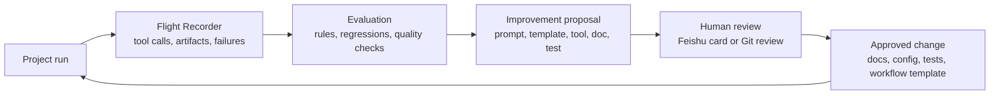
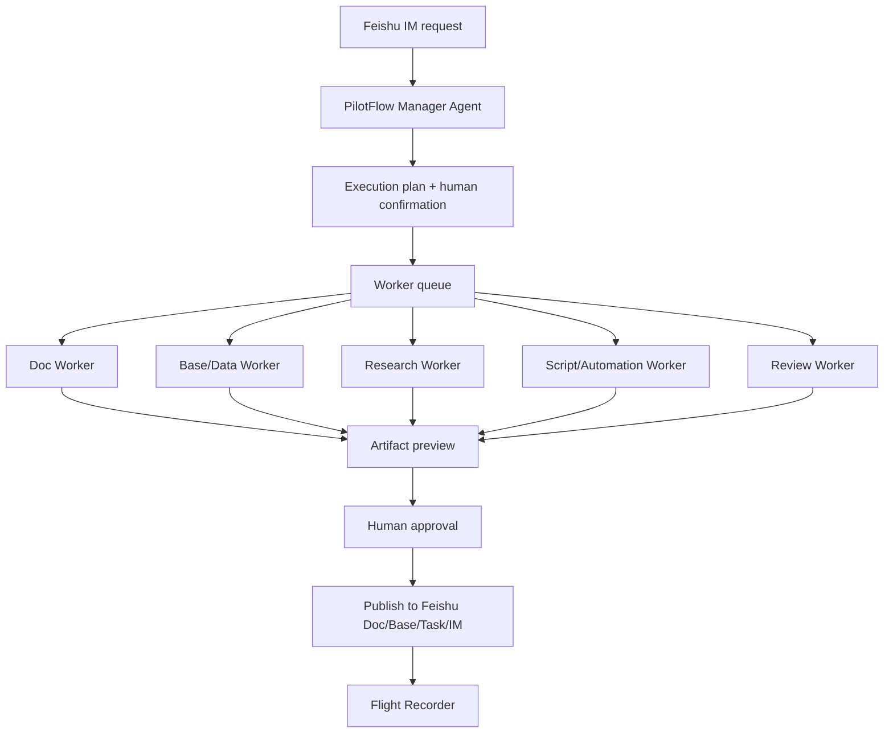

# Agent Evolution

PilotFlow has already borrowed the first layer of Hermes-style engineering: typed runtime boundaries, a tool registry, Feishu gateway parsing, session queues, retry/error classification, hermetic tests, and run traces. The next layer is not "more agents everywhere"; it is a controlled evolution loop that lets PilotFlow learn from each project run and coordinate specialist workers when the work is too broad for one deterministic flow.

## Product Stance

PilotFlow should feel like a Feishu-native project operations officer, not a generic autonomous coding framework. Hermes is the runtime reference; Feishu collaboration is the product surface.

| Question | PilotFlow answer |
| --- | --- |
| Is PilotFlow a self-modifying production bot? | No. It can propose improvements, but code/docs/tool changes require human approval and Git review. |
| Is PilotFlow a multi-agent system? | Eventually, yes, but only behind a manager-worker boundary where the Pilot remains accountable. |
| Does every workflow need an LLM? | No. Deterministic project-init remains a reliable path; LLM planning and workers are opt-in routes through the same tool registry. |
| What makes it "evolve"? | Run traces, evaluations, failure records, and human feedback are converted into improvement proposals, test cases, prompt updates, and workflow templates. |

## Hermes Ideas We Have Actually Adopted

| Hermes pattern | PilotFlow adaptation | Current status |
| --- | --- | --- |
| Agent loop | `src/agent/loop.ts` while-next loop with tool calls and max-iteration guard | Implemented in TS dry-run smoke path |
| Tool registry | LLM-safe tool names, preflight, confirmation enforcement, recorder redaction | Implemented in `src/tools/registry.ts` |
| Feishu gateway | Message/card normalization, mention gate, event dedupe, per-chat queue | Implemented under `src/gateway/feishu/` |
| Error taxonomy | Retryable/non-retryable LLM/provider classification | Implemented under `src/llm/` |
| Session manager | Bounded per-chat state with TTL and history cap | Implemented under `src/agent/session-manager.ts` |
| Hermetic tests | Mock LLM, dry-run tools, deterministic event fixtures | Implemented in TS test suite |
| Trace-first operation | JSONL run log, Flight Recorder, generated review packs | Implemented in JS/TS paths |
| Retrospective pack | Turn a run trace into quality signals, improvement proposals, and eval seeds | Implemented in `src/review-packs/run-retrospective-pack.js` |

## Hermes Ideas To Adopt Next

| Pattern | PilotFlow adaptation | Why it matters |
| --- | --- | --- |
| Context compression | Summarize old tool outputs and project history into bounded session state | Makes long-running group projects viable without ballooning prompts |
| Memory provider | Store project facts, team preferences, recurring owners, and prior decisions in Feishu-native state | Lets PilotFlow improve across runs without scraping whole chat history |
| Evaluation loop | Convert run logs and failure packs into recurring eval cases | Gives measurable self-improvement instead of vibes |
| Credential/provider policy | Local provider failover and model routing for planning vs review tasks | Keeps demos resilient and cost-aware |
| Worker orchestration | Specialist workers produce artifacts for review; Pilot publishes only after approval | Makes the product useful beyond project setup while preserving control |

## Self-Evolution Loop

Self-evolution should be a visible operating loop, not hidden self-modification.



### Evolution Artifacts

| Artifact | Stored where | Product use |
| --- | --- | --- |
| Run trace | JSONL now; future Base/SQLite | Explain what happened |
| Failure case | Generated review pack or eval fixture | Prevent repeat failures |
| Project memory | Future Base table or local ignored store | Remember stable team preferences |
| Workflow template | Docs/Base row or versioned JSON | Reuse successful project patterns |
| Improvement proposal | Feishu Doc/Card and Git issue/PR later | Keep changes reviewable |
| Run retrospective | `tmp/run-retrospective/RUN_RETROSPECTIVE.md` | Summarize run quality signals and candidate eval cases |
| Retrospective eval | `tmp/retrospective-eval/RETROSPECTIVE_EVAL.md` | Check the current run against review cases before publishing claims |

### Guardrails

- No hidden writes to code, docs, prompts, or Feishu artifacts.
- No automatic replay of old group history without explicit scope.
- No worker artifact is published to Doc/Base/Task without a confirmation gate.
- Every proposed improvement must cite the run log, failure, or user feedback that triggered it.
- Generated evals and templates must be reviewed before becoming defaults.

## Worker Orchestration Model

The Pilot stays the manager. Workers are scoped executors. This matches the user's product direction: it should help non-programmers with scripts, documents, research, tables, and project materials, not only code.



### Worker Types

| Worker | Useful for | First safe version |
| --- | --- | --- |
| Doc Worker | Briefs, meeting notes, reports, submission material | Generate markdown preview; publish after approval |
| Base/Data Worker | Table cleanup, field normalization, status summaries | Dry-run row diff; apply after approval |
| Research Worker | Competitive research, references, feasibility notes | Produce source-linked notes; reviewer checks before publishing |
| Script/Automation Worker | Small local scripts, data transforms, recurring checks | Run in local sandbox or dry-run; attach output as artifact |
| Review Worker | Quality checks, risk checks, docs consistency | Comment/report only; no side effects |

### Why This Is Not Too Heavy

The heavy part of multi-agent systems is uncontrolled parallelism. PilotFlow can avoid that by keeping a small, typed contract:

```text
WorkerRequest:
  run_id
  worker_type
  objective
  inputs
  allowed_tools
  output_contract
  risk_level

WorkerResult:
  status
  summary
  artifacts
  proposed_feishu_writes
  risks
  next_confirmation
```

Workers do not own Feishu writes. They return preview artifacts and proposed actions. The Pilot owns approval, publishing, and recording.

## Implementation Roadmap

### Stage A: Evolution Records

- [ ] Add a structured `run.review` event shape to Flight Recorder.
- [x] Add a generated "Run Retrospective Pack" from JSONL logs.
- [x] Add a first Retrospective Eval runner over optional fallback, missing owner, TBD deadline, planner validation fallback, and tool failure traces.
- [ ] Promote failure cases into stable snapshot-backed eval fixtures.
- [x] Add first quality signals: missing owner, missing due date, failed optional tool, and optional fallback used.
- [ ] Extend quality signals for callback pending, duplicate blocked, and manual fallback used.

### Stage B: Memory And Compression

- [ ] Add bounded session compression for old tool outputs.
- [ ] Add project memory schema: team preferences, recurring owners, project templates, known platform limits.
- [ ] Store memory in ignored local state first; later mirror approved memory to Feishu Base.
- [ ] Add memory scrubber rules so secrets and personal identifiers do not leak into prompts or public docs.

### Stage C: Worker Preview

- [x] Implement a `WorkerRequest` / `WorkerResult` type contract.
- [x] Add a single Review Worker first because it is read-only and low risk.
- [ ] Add Doc Worker preview generation.
- [ ] Add Base/Data Worker dry-run diff.
- [ ] Add Script/Automation Worker behind local sandbox and explicit approval.

Current implementation: `src/agent/review-worker.ts` accepts retrospective and eval inputs, returns a `worker_review` preview artifact, and emits proposed Feishu Doc content with `confirmed: false`. It does not call `lark-cli`, ToolRegistry, or any Feishu API directly.

### Stage D: Managed Orchestration

- [ ] Add per-chat worker queue and concurrency limit.
- [ ] Add worker progress cards in Feishu.
- [ ] Add artifact approval card before publishing worker output.
- [ ] Record all worker decisions in Flight Recorder.
- [ ] Promote successful worker flows into reusable project templates.

## Near-Term Product Decision

For the competition MVP, self-evolution should appear as:

1. A visible trace: Flight Recorder shows what happened.
2. A visible evaluation: review packs explain what passed, degraded, or failed.
3. A visible improvement proposal: PilotFlow can recommend the next prompt/template/tool/test change.
4. A visible human gate: no automatic product or code mutation without approval.

This gives the product a credible "learning system" story without claiming an unsafe autonomous runtime.
