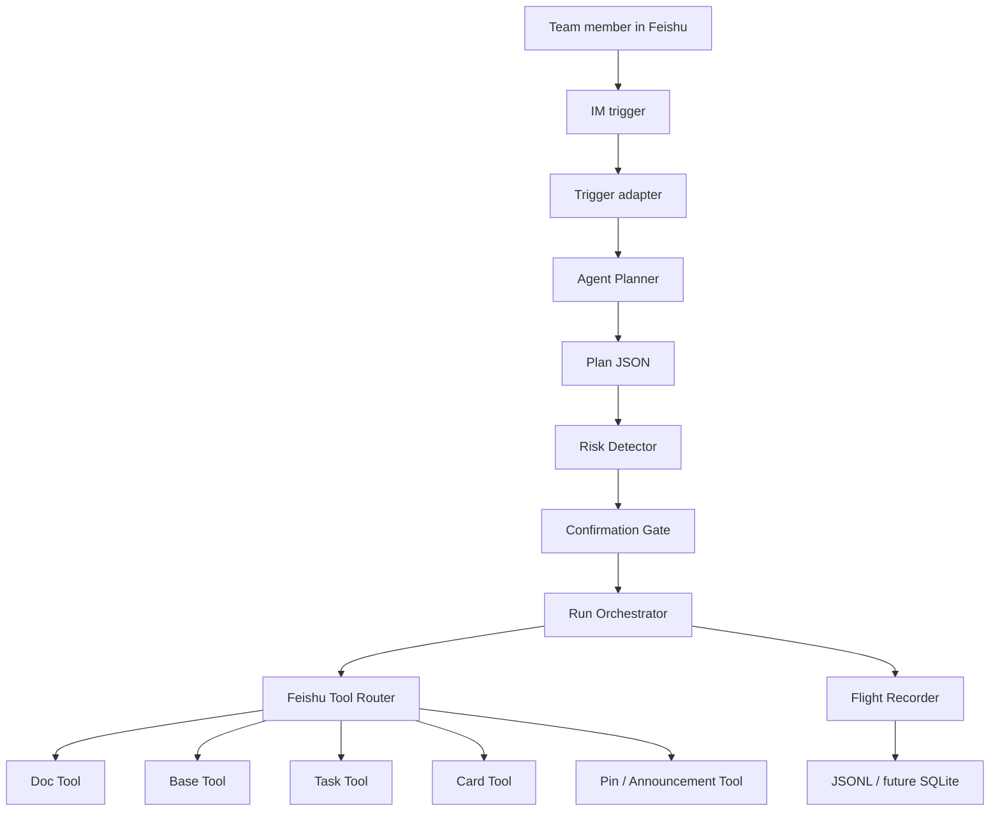
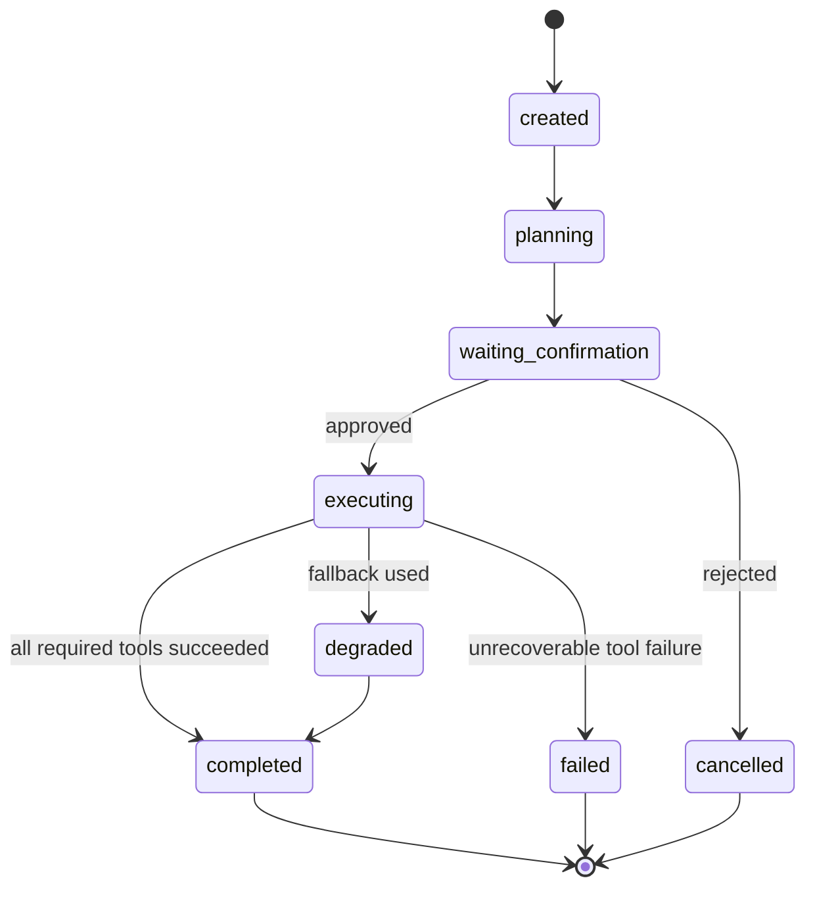
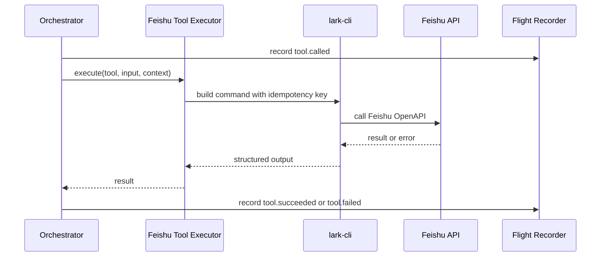
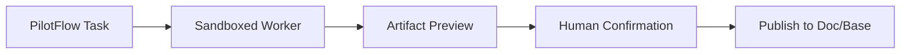

# Architecture

PilotFlow uses a deliberately small architecture for the first MVP:

```text
Single Agent + State Machine + Confirmation Gate + Feishu Tool Router + Flight Recorder
```

The goal is not to build a large multi-agent system first. The goal is to make one traceable, controllable Agent reliably operate Feishu-native surfaces.

## System Overview



## Core Components

| Component | Responsibility | Current status |
| --- | --- | --- |
| Trigger | Starts a run from manual input now, IM event later | manual trigger implemented; TS Feishu gateway boundary added |
| Planner | Converts input into project plan JSON | deterministic prototype planner implemented behind JS and TS provider boundaries |
| Confirmation Gate | Stops side effects until human approval | execution plan card, dry-run auto-confirm, live text fallback, callback action protocol, and bounded callback listener implemented |
| Duplicate Run Guard | Blocks accidental repeated live runs for the same project target | local guard file implemented under `tmp/run-guard/` |
| Orchestrator | Owns run lifecycle and tool sequence | Doc/Base/Task/risk/entry/announcement/pin/IM sequence implemented with artifact-aware messages and state rows |
| Domain Layer | Owns deterministic planning, validation fallback, risk logic, card data, and product text rendering | TS domain modules added in `src/domain/`; one-line IM field parsing and input cleanup are now covered by tests |
| Tool Step Runner | Records tool calls, artifacts, skipped steps, and optional fallbacks | shared runtime helper split into `src/runtime/` |
| Feishu Tool Executor | Converts tool calls into `lark-cli` commands | current JS executor remains live-capable; TS Feishu tools and ToolRegistry are live-guarded and have one product-path live proof |
| Tool Registry | Maps internal tool names to LLM-safe schemas, validates live targets, records tool events, and enforces confirmation for live side effects | TS `ToolRegistry` implemented with 9 self-registering Feishu tool definitions |
| Flight Recorder | Records events, tool calls, artifacts, failures | JSONL with step status and artifact events implemented |
| Risk Engine | Enriches planner risks and creates a decision summary | initial detector and risk decision card implemented |
| Cockpit | Shows run state and replay | static Flight Recorder HTML view implemented |
| Card Event Listener | Streams Feishu card callbacks and triggers approved runs | code-level listener and callback-trigger bridge implemented; live listener connected but callback delivery still pending |
| LLM Client | Calls OpenAI-compatible chat completions with tool schemas | minimal TS client implemented with mock-fetch tests; real online success is not a rebuild gate |
| Agent Loop | Runs while-next LLM -> tool calls -> registry -> tool output | TS loop implemented behind ToolRegistry and confirmation gate; deterministic orchestrator remains default path |
| Feishu Gateway | Normalizes Feishu IM/card events before Agent/session routing | lark-cli NDJSON parser, mention gate, dedupe, per-chat queue, message/card handlers, webhook contract helpers, and dry-run CLI smoke bridge implemented |

## Run State



## Data Model

The current schemas live in `src/schemas`. The current planner is deterministic prototype logic, exposed through `DeterministicProjectInitPlanner`; an LLM planner can be added later behind the same provider boundary without changing the confirmation and tool execution contract.

| Schema | Meaning |
| --- | --- |
| `Run` | One execution of a PilotFlow workflow |
| `Plan` | Agent-generated project execution plan |
| `Step` | Unit of planned work |
| `ToolCall` | One call to a Feishu or local tool |
| `Confirmation` | Human approval gate |
| `Artifact` | Created Doc, Task, Base record, card, entry message, announcement attempt, pinned message, summary, or run log |
| `Risk` | Risk item detected or entered during planning |

Artifact normalization currently supports Feishu Doc, Base record batch writes, Task creation, card sends, project entry messages, announcement update attempts, pinned messages, IM message sends, and local run logs. Dry-run artifacts are marked `planned`; live artifacts are marked `created` once the corresponding `lark-cli` call succeeds. Optional announcement failures are marked `failed` and do not abort the run. Base record artifacts also expose fallback fields such as `owner`, `due_date`, `risk_level`, `source_run`, `source_message`, and `url` for Flight Recorder and demo inspection.

The TypeScript rebuild path now has `src/tools/registry.ts`, `src/tools/idempotency.ts`, self-registering Feishu tool definitions under `src/tools/feishu/*.ts`, a split `src/orchestrator/` layer, `src/llm/`, `src/agent/`, and `src/gateway/feishu/`. The TS orchestrator owns validation fallback, confirmation gating, batch preflight, deterministic tool sequencing, optional fallback handling, callback parsing, Project State row building, assignee/contact resolution, and an atomic duplicate guard with TTL cleanup. The Agent loop uses the same ToolRegistry schema/execute surface, so LLM-driven tool calls cannot bypass registry preflight or confirmation enforcement. `pilot:project-init-ts` exposes the deterministic TS project-init bridge with live confirmation/preflight guards, while `pilot:run` wraps that path as the product-facing entry with plan card, entry message, pinned entry, and risk card enabled by default. On 2026-05-01 `pilot:run` completed one real live Feishu write loop; the existing JS runtime remains available until repeated TS parity and real callback-driven continuation are proven.

The Feishu gateway follows the Hermes pattern in a reduced form: default event input is `lark-cli event +subscribe` NDJSON, not a public webhook. The gateway can parse message and card events, apply DM/@mention filtering, dedupe event IDs, and serialize work per chat. `pilot:agent-smoke` exercises this path locally with a mock LLM and dry-run Feishu tools. The webhook helper only implements signature and verification-token contract tests; real encrypted webhook payloads, public callback delivery, and synchronous card mutation are deferred until platform fixtures are verified.

Plan validation runs immediately after planner output and before confirmation, preflight, duplicate-run guard, or any Feishu tool call. If required project-init fields fail validation, PilotFlow records `plan.validation_failed`, returns `needs_clarification`, and uses a safe fallback plan instead of creating Doc/Base/Task/IM artifacts.

The risk detector runs immediately after the plan is generated. It preserves planner risks and adds derived risks such as missing members, missing deliverables, non-concrete deadlines, and text-only owner mappings. The same detected risk list is used for the run output, Base risk rows, and optional risk decision card, so the product surfaces stay consistent.

Task assignee resolution runs before `task.create`. Planner member labels remain human-readable, while `PILOTFLOW_OWNER_OPEN_ID_MAP_JSON` can map those labels to Feishu `open_id` values. If no explicit map matches and `PILOTFLOW_AUTO_LOOKUP_OWNER_CONTACT` is enabled, PilotFlow performs a read-only `contact +search-user` lookup and assigns the first task only when the result is exact or unambiguous. If lookup is blocked or ambiguous, PilotFlow keeps the text owner fallback in the task description and run trace. The priority order is explicit owner map, optional contact lookup, optional default assignee, then text fallback.

The project execution plan card is generated before side effects and can be sent with `--send-plan-card`. Its buttons carry a stable `pilotflow_card`, `pilotflow_run_id`, and `pilotflow_action` value for confirm, edit, doc-only, and cancel decisions. The risk decision card is generated after Doc/Base/Task writes and can be sent with `--send-risk-card`; its buttons use the same callback value convention for owner, deadline, accept, and defer decisions. `card-callback-handler.js` parses Feishu-style callback payloads, while `card-event-listener.js` wraps `lark-cli event +subscribe` and `callback-run-trigger.js` can start the orchestrator from an approved execution-plan callback. This is code-level wiring; a live listener attempt connected to Feishu but received no callback event, so Open Platform card callback configuration is the remaining validation.

The project entry message is generated after Doc, Base, and Task calls complete and can be sent with `--send-entry-message` as the current fallback for a stable group entrance. `--pin-entry-message` sends that entry message and then calls `im.pins.create` to pin it in the target chat. `--update-announcement` attempts the native group announcement API as bot identity; the current test group returns `232097 Unable to operate docx type chat announcement`, so PilotFlow records a failed announcement artifact and continues with the pinned entry fallback. The final IM summary is generated afterward, so the group message can include the created Doc URL, Base record IDs, Task URL, project entry state, announcement fallback state, run ID, and next-step prompt.

The duplicate-run guard runs after live target preflight and before Feishu side effects. It computes a stable project-init key from normalized input, plan shape, profile, and hashed targets. The guard file lives in ignored local storage by default, so it protects live demos on the operator machine without publishing target IDs or secrets.

## Project State Rows

The current Base state template is shared by `pilot:setup` and the orchestrator:

| Field | Purpose |
| --- | --- |
| `type` | `task`, `risk`, or `artifact` |
| `title` | Human-readable item title |
| `owner` | Human-readable owner label, also used as the contact lookup query when enabled |
| `due_date` | Text fallback due date, or `TBD` |
| `status` | `todo`, `open`, `planned`, `created`, or failure status |
| `risk_level` | Risk severity for risk rows |
| `source_run` | PilotFlow run ID |
| `source_message` | Source message ID when available, otherwise `manual-trigger` |
| `url` | Artifact link when already known |

This is intentionally text-first for the Base table. The Task creation path can accept an explicit owner-label to `open_id` map, or optionally search Feishu Contacts for the first task owner. Ambiguous names do not auto-assign; the run records the lookup result and falls back to the text owner.

## Tool Routing



## Feishu Execution Modes

| Mode | Purpose |
| --- | --- |
| `dry-run` | Build commands and record expected side effects without writing |
| `live` | Execute `lark-cli` against the activity tenant profile |
| `fallback` | Write local JSONL or text summary when a Feishu capability is blocked |

Runtime variables:

```text
PILOTFLOW_FEISHU_MODE=dry-run|live
PILOTFLOW_LARK_PROFILE=pilotflow-contest
PILOTFLOW_SEND_PLAN_CARD=true|false
PILOTFLOW_SEND_ENTRY_MESSAGE=true|false
PILOTFLOW_PIN_ENTRY_MESSAGE=true|false
PILOTFLOW_UPDATE_ANNOUNCEMENT=true|false
PILOTFLOW_SEND_RISK_CARD=true|false
PILOTFLOW_DEDUPE_KEY=<optional_stable_key>
PILOTFLOW_ALLOW_DUPLICATE_RUN=true|false
PILOTFLOW_DISABLE_DUPLICATE_GUARD=true|false
PILOTFLOW_STORAGE_PATH=tmp/run-guard/project-init-runs
PILOTFLOW_TEST_CHAT_ID=<oc_xxx>
PILOTFLOW_BASE_TOKEN=<base_token>
PILOTFLOW_BASE_TABLE_ID=<tbl_xxx>
PILOTFLOW_TASKLIST_ID=<tasklist_guid_or_url>
PILOTFLOW_OWNER_OPEN_ID_MAP_JSON={"Product Owner":"ou_xxx"}
PILOTFLOW_AUTO_LOOKUP_OWNER_CONTACT=true|false
PILOTFLOW_TASK_ASSIGNEE_OPEN_ID=<optional_default_open_id>
PILOTFLOW_CONFIRMATION_TEXT=确认执行
PILOTFLOW_LISTENER_MAX_EVENTS=<optional_max_events>
PILOTFLOW_LISTENER_TIMEOUT=<optional_timeout_like_30s>
PILOTFLOW_LLM_BASE_URL=<openai_compatible_base_url>
PILOTFLOW_LLM_API_KEY=<local_only_api_key>
PILOTFLOW_LLM_MODEL=<model_name>
PILOTFLOW_LLM_FALLBACK_MODELS=<comma_separated_optional_models>
PILOTFLOW_LLM_MAX_TOKENS=4096
PILOTFLOW_LLM_TEMPERATURE=0.1
```

Live mode requires the primary confirmation text `确认执行`; the previous wording remains accepted as a compatibility alias only. It also preflights required Base and chat targets before the first Feishu write so a missing target does not create a partial Doc-only run. CLI project input is normalized before planning: Windows/npm caret artifacts are removed, common one-line IM field labels are parsed, Doc bodies are passed to `lark-cli` through repo-relative ignored temp files, multiline IM text is sent through JSON content, and default latest JSONL outputs are reset per run.

## Reliability Rules

- Every write tool must receive a Feishu-safe idempotency key no longer than the message API field limit.
- TypeScript registry live calls must pass explicit confirmation for tools marked `confirmationRequired`.
- Live project-init runs must pass duplicate-run protection before visible side effects.
- Tool failures must stop or degrade the run explicitly.
- Invalid planner output must become a clarification state before any Feishu side effect.
- The Agent must never invent a successful Feishu write.
- Run logs must include planned input and actual output.
- Run logs must redact tool inputs, command arguments, and failure output summaries.
- Human confirmation is required before writing project artifacts.
- Local Windows execution bypasses shell string concatenation by invoking the installed `lark-cli` Node entrypoint with an argument array.

## Why Not Multi-Agent First

Multi-agent execution is useful later for worker artifacts, but it increases operational complexity. The MVP keeps one Agent in charge of planning and routing so the demo remains explainable, debuggable, and Feishu-native.

Worker route later:



## Self-Evolution Boundary

PilotFlow should evolve from traces, not from hidden self-modification. The Hermes-inspired runtime gives the building blocks: bounded sessions, tool-call records, error classification, retry hints, and hermetic tests. The product evolution loop is:

```text
Flight Recorder -> Evaluation -> Improvement proposal -> Human approval -> Updated workflow/template/test
```

The first implementation generates retrospectives and eval cases from JSONL logs, then uses a preview-only Review Worker contract for proposed review output. Workers may return artifacts and proposed Feishu writes, but proposed writes are marked unconfirmed and are not executed by the worker. Later versions can add project memory, context compression, document/data/script workers, and Feishu approval cards. Code, prompt, template, and Feishu publishing changes must remain review-gated.

Detailed plan: [AGENT_EVOLUTION.md](AGENT_EVOLUTION.md).

## Structured Extraction Engine

PilotFlow 的结构化提取引擎负责将自然语言群聊文本解析为结构化的项目执行计划（`ProjectInitPlan`）。当前实现采用确定性原型方案（`DeterministicProjectInitPlanner`），通过统一的 `PlannerProvider` 接口暴露，可在未来替换为 LLM 驱动的规划器而不影响下游确认门控和工具执行契约。

### 解析流程

```text
输入文本 → 行级字段提取 → 列表拆分 → 缺失字段标记 → 计划 JSON 构建
```

1. **行级字段提取**：`parseDemoInput` 逐行扫描输入文本，匹配 `Key: Value` 格式（正则 `/^([A-Za-z ]+):\s*(.+)$/`），将键名归一化为小写下划线形式（如 `Deliverables` → `deliverables`）。
2. **目标推导**：若未显式提供 `goal` 字段，取输入文本首个非空行作为目标；若均为空，回退到默认值 `"Launch a project from group discussion"`。
3. **列表拆分**：成员、交付物、风险列表通过 `splitList` 按中英文逗号和分号（`/[,;，；]/`）拆分，并去除首尾空白。
4. **风险结构化**：原始风险文本被包装为带 `id`、`title`、`level`（默认 `medium`）、`status`（默认 `open`）的风险对象。
5. **缺失字段标记**：引擎检查 `members`、`deliverables`、`deadline` 三项，缺失时写入 `missing_info` 数组，供下游验证和澄清流程使用。

### 提取策略边界

| 维度 | 当前实现 | 未来扩展 |
| --- | --- | --- |
| 解析方式 | 基于正则的键值对提取 | LLM 结构化输出（JSON mode / function calling） |
| 列表分隔 | 中英文逗号和分号 | NLP 实体识别 |
| 日期解析 | 原样透传，仅校验 `YYYY-MM-DD` 格式 | 自然语言日期规范化（"下周五" → `2026-05-08`） |
| 风险等级 | 固定 `medium` | LLM 语义评级或规则引擎 |

### 计划验证与降级

计划生成后立即运行 `validatePlan`。若必填字段验证失败，PilotFlow 不会创建任何飞书副作用对象，而是生成一个安全的降级计划（`buildFallbackPlan`），记录 `plan.validation_failed` 事件，并将运行状态设为 `needs_clarification`，等待人工补充信息。

## Tool Orchestration Logic

编排器（`Orchestrator`）是运行生命周期的唯一所有者，负责从计划生成到工具执行再到结果记录的完整链路。

### 工具调用顺序

工具序列在 `buildToolSequence` 中声明式构建，执行顺序如下：

| 步骤 | 工具 | 说明 | 可选 |
| --- | --- | --- | --- |
| step-confirm | `card.send` | 发送执行计划卡片，请求人工确认 | 否（由 `--send-plan-card` 控制是否在此阶段发送） |
| step-doc | `doc.create` | 创建项目简报文档 | 否 |
| step-state | `base.write` | 将任务、风险、制品写入多维表格 | 否 |
| step-task | `task.create` | 创建首个任务（含负责人/截止时间上下文） | 否 |
| step-risk | `card.send` | 发送风险裁决卡 | 是（由 `--send-risk-card` 控制） |
| step-entry | `entry.send` | 发送项目入驻消息到目标群 | 是 |
| step-announcement | `announcement.update` | 尝试升级为群公告 | 是（`optional: true`，失败不中断） |
| step-pin | `entry.pin` | 置顶项目入驻消息 | 是 |
| step-summary | `im.send` | 发送交付摘要消息 | 否 |

每个步骤的输入通过闭包函数 `(ctx: SequenceContext) => Record<string, unknown>` 动态生成，可访问前序步骤产出的制品列表，实现制品间的数据传递（如 `step-pin` 依赖 `step-entry` 产出的消息 ID）。

### 跳过与降级策略

**条件跳过**：每个步骤可定义 `skip` 函数，返回跳过原因字符串时该步骤被标记为 `skipped` 并跳过。例如未启用 `--send-risk-card` 时，`step-risk` 返回 `"risk decision card disabled"`。

**必选步骤失败**：非可选步骤（`optional !== true`）失败时，执行器立即将该步骤标记为 `failed`，向上抛出异常终止整个序列。编排器捕获异常后将重复运行守卫标记为 `fail`，记录 `run.failed` 事件，并将失败制品数量传递给守卫。

**可选步骤降级**：可选步骤（如 `announcement.update`）失败时，执行器：
1. 生成一个 `status: "failed"` 的制品记录
2. 记录 `artifact.failed` 和 `optional_tool.fallback` 事件（回退路径为 `continue_with_existing_project_entry_path`）
3. 将步骤状态标记为 `succeeded`（原因 `"optional fallback"`）
4. 继续执行后续步骤

这确保了群公告 API 受限（如返回 `232097 Unable to operate docx type chat announcement`）时，置顶消息和摘要消息仍能正常发送。

### 预检机制

`preflightToolSequence` 在实际执行前遍历所有活跃步骤，检查每个工具声明的 `requiresTargets`（如 `chatId`、`baseToken`、`tasklistId`）是否在运行时目标配置中已提供。缺失任何必需目标时抛出 `ToolPreflightError`，避免在飞书写入链路中途因配置缺失而产生部分制品。

## Idempotency Protection

幂等保护分为工具级和运行级两层。

### 工具级幂等键

每次工具调用通过 `buildToolIdempotencyKey` 生成飞书安全的幂等键：

```text
pf-{tool_slug}-{sequence}-{sha256_hash_prefix}
```

- `tool_slug`：工具名中 `.` 替换为 `-`，仅保留 `[a-zA-Z0-9_-]`，截断至 20 字符
- `sequence`：步骤序号，截断至 6 字符
- `sha256_hash_prefix`：`runId:tool:sequence` 的 SHA-256 哈希前 16 位

该键长度不超过飞书消息 API 字段限制，确保重复提交时飞书端能正确去重。

### 运行级重复守卫

`DuplicateGuard` 在飞书副作用开始前运行，防止同一项目目标被意外重复执行：

1. **键生成**：`buildProjectInitDedupeKey` 基于计划内容、运行配置和目标范围计算稳定键，或使用显式提供的 `--dedupe-key`
2. **锁文件**：使用 `open(filePath, 'wx')`（排他创建）原子写入 JSON 锁文件，文件名为键的 SHA-256 哈希前 32 位
3. **冲突处理**：若锁文件已存在且未过期（TTL 默认 24 小时），抛出 `GuardBlockedError`；若已过期则删除后重新创建
4. **生命周期**：运行完成时调用 `complete` 标记为 `completed`，运行失败时调用 `fail` 标记为 `failed`，两者均更新制品计数
5. **绕过机制**：`--allow-duplicate-run` 可跳过守卫（返回 `bypassed` 状态），`--disable-duplicate-guard` 完全禁用

锁文件存储在 `tmp/run-guard/` 下（默认被 `.gitignore` 忽略），不泄露目标 ID 或密钥。

## Error Handling

### 错误分类

| 错误类型 | 错误码 | 触发场景 | 处理方式 |
| --- | --- | --- | --- |
| `PilotFlowError` | 基类 | 所有 PilotFlow 业务错误 | 携带结构化 `code` 和 `details`，Flight Recorder 记录完整上下文 |
| `ConfigurationError` | `CONFIGURATION_ERROR` | 环境变量缺失或格式错误 | 运行前快速失败，不产生副作用 |
| `CommandFailedError` | `COMMAND_FAILED` | `lark-cli` 命令执行返回非零退出码 | 记录命令输出，根据步骤可选性决定降级或终止 |
| `CommandTimeoutError` | `COMMAND_TIMEOUT` | `lark-cli` 命令执行超时 | 记录超时事件，与 `CommandFailedError` 同等处理 |
| `ToolNotFoundError` | `TOOL_NOT_FOUND` | 请求未注册的工具名 | 运行时快速失败 |
| `ToolPreflightError` | `TOOL_PREFLIGHT_FAILED` | 工具缺少必需的飞书目标参数 | 在副作用前快速失败，避免部分写入 |
| `ToolInputError` | `TOOL_INPUT_INVALID` | 工具输入参数类型或格式错误 | 运行时快速失败 |
| `ToolConfirmationRequiredError` | `TOOL_CONFIRMATION_REQUIRED` | live 模式下未确认就执行需确认的工具 | 阻止执行，要求人工确认 |
| `ToolAlreadyRegisteredError` | `TOOL_ALREADY_REGISTERED` | 同名工具重复注册 | 启动时快速失败 |
| `GuardBlockedError` | `DUPLICATE_RUN_BLOCKED` | 重复运行守卫检测到活跃的重复运行 | 阻止执行，提示使用 `--allow-duplicate-run` |

### 重试策略

当前实现不内置自动重试。设计决策基于以下考量：

- **飞书 API 的非幂等性**：部分写入操作（如文档创建）即使携带幂等键，重复调用也可能产生副作用
- **错误的可恢复性差异**：网络瞬断可重试，权限不足不可重试，盲目重试可能放大问题
- **可观测性优先**：每次失败均被 Flight Recorder 完整记录，由人工或未来评估流程决定是否重试

运行级重复守卫的 TTL 过期机制（默认 24 小时）提供了一种隐式的"冷却重试"窗口：守卫过期后同一项目目标可重新执行。

### 降级路径

```text
live 工具失败
  ├── 可选步骤（optional: true）
  │     └── 记录 failed 制品 → 记录 fallback 事件 → 标记步骤 succeeded → 继续
  ├── 必选步骤
  │     └── 标记步骤 failed → 抛出异常 → 守卫标记 fail → 记录 run.failed → 终止
  └── 验证失败（plan 层面）
        └── 生成降级计划 → 记录 validation_failed → 状态设为 needs_clarification → 不执行任何飞书写入
```

飞书执行模式的三层降级：

| 模式 | 行为 |
| --- | --- |
| `dry-run` | 构建命令、记录预期副作用，不实际写入；制品标记为 `planned` |
| `live` | 通过 `lark-cli` 调用飞书 OpenAPI；制品标记为 `created` |
| `fallback` | 飞书能力受限时写入本地 JSONL 或文本摘要 |

所有错误事件均通过 Flight Recorder 记录，包含工具名、错误码、错误消息（经 `redactObject` 脱敏）、步骤序号和运行 ID，确保可追溯性。
