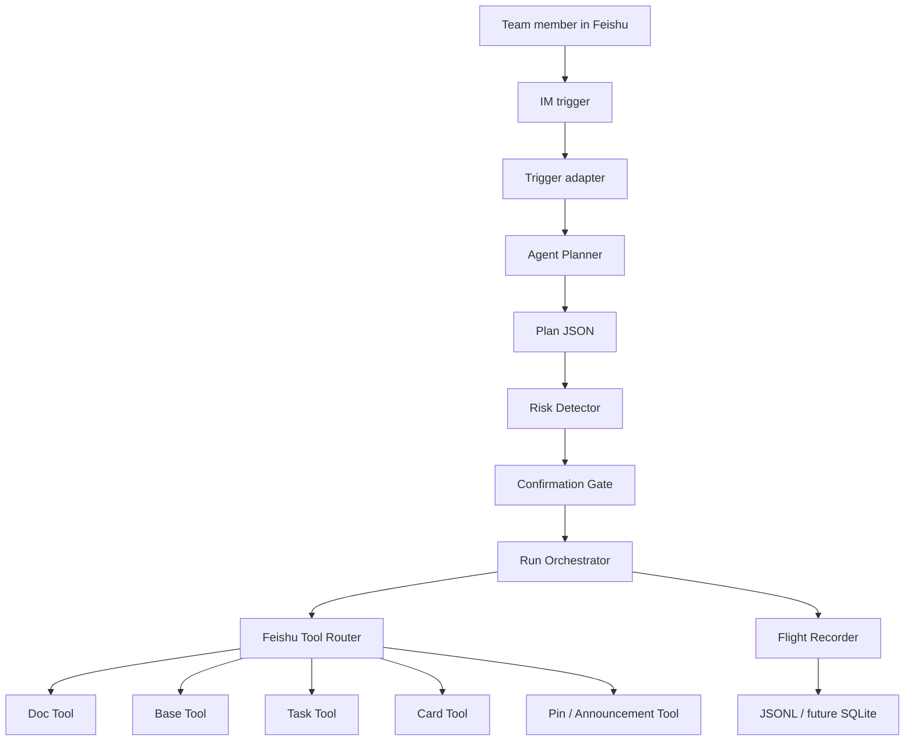
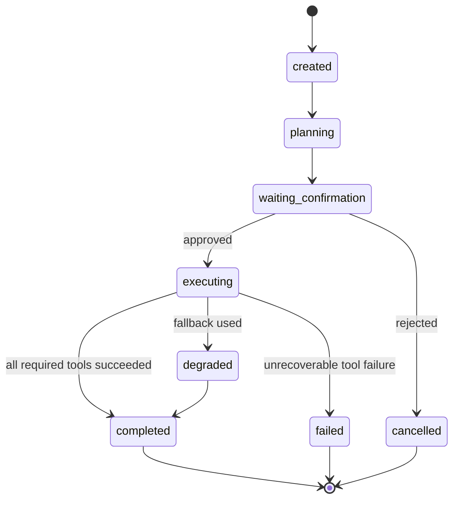
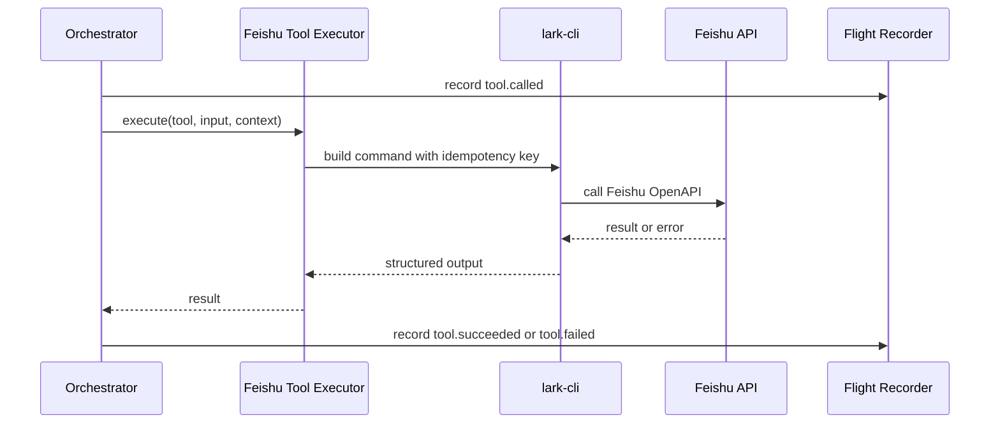
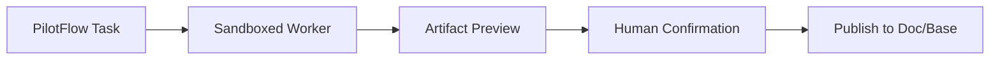

# Architecture

PilotFlow uses a deliberately small architecture for the first MVP:

```text
Single Agent + State Machine + Confirmation Gate + Feishu Tool Router + Flight Recorder
```

The goal is not to build a large multi-agent system first. The goal is to make one traceable, controllable Agent reliably operate Feishu-native surfaces.

## System Overview



## Core Components

| Component | Responsibility | Current status |
| --- | --- | --- |
| Trigger | Starts a run from manual input now, IM event later | manual trigger implemented |
| Planner | Converts input into project plan JSON | deterministic prototype planner implemented behind JS and TS provider boundaries |
| Confirmation Gate | Stops side effects until human approval | flight plan card, dry-run auto-confirm, live text fallback, callback action protocol, and bounded callback listener implemented |
| Duplicate Run Guard | Blocks accidental repeated live runs for the same project target | local guard file implemented under `tmp/run-guard/` |
| Orchestrator | Owns run lifecycle and tool sequence | Doc/Base/Task/risk/entry/announcement/pin/IM sequence implemented with artifact-aware messages and state rows |
| Domain Layer | Owns deterministic planning, validation fallback, risk logic, card data, and product text rendering | TS domain modules added in `src/domain/`; old JS prototype remains until the TS path is fully wired |
| Tool Step Runner | Records tool calls, artifacts, skipped steps, and optional fallbacks | shared runtime helper split into `src/runtime/` |
| Feishu Tool Executor | Converts tool calls into `lark-cli` commands | current JS executor remains live-capable; TS Feishu tools and ToolRegistry are implemented for the rebuild path |
| Tool Registry | Maps internal tool names to LLM-safe schemas, validates live targets, records tool events, and enforces confirmation for live side effects | TS `ToolRegistry` implemented with 9 self-registering Feishu tool definitions |
| Flight Recorder | Records events, tool calls, artifacts, failures | JSONL with step status and artifact events implemented |
| Risk Engine | Enriches planner risks and creates a decision summary | initial detector and risk decision card implemented |
| Cockpit | Shows run state and replay | static Flight Recorder HTML view implemented |
| Card Event Listener | Streams Feishu card callbacks and triggers approved runs | code-level listener and callback-trigger bridge implemented; live listener connected but callback delivery still pending |

## Run State



## Data Model

The current schemas live in `src/schemas`. The current planner is deterministic prototype logic, exposed through `DeterministicProjectInitPlanner`; an LLM planner can be added later behind the same provider boundary without changing the confirmation and tool execution contract.

| Schema | Meaning |
| --- | --- |
| `Run` | One execution of a PilotFlow workflow |
| `Plan` | Agent-generated project flight plan |
| `Step` | Unit of planned work |
| `ToolCall` | One call to a Feishu or local tool |
| `Confirmation` | Human approval gate |
| `Artifact` | Created Doc, Task, Base record, card, entry message, announcement attempt, pinned message, summary, or run log |
| `Risk` | Risk item detected or entered during planning |

Artifact normalization currently supports Feishu Doc, Base record batch writes, Task creation, card sends, project entry messages, announcement update attempts, pinned messages, IM message sends, and local run logs. Dry-run artifacts are marked `planned`; live artifacts are marked `created` once the corresponding `lark-cli` call succeeds. Optional announcement failures are marked `failed` and do not abort the run. Base record artifacts also expose fallback fields such as `owner`, `due_date`, `risk_level`, `source_run`, `source_message`, and `url` for Flight Recorder and demo inspection.

The TypeScript rebuild path now has `src/tools/registry.ts`, `src/tools/idempotency.ts`, self-registering Feishu tool definitions under `src/tools/feishu/*.ts`, and a split `src/orchestrator/` layer. The TS orchestrator owns validation fallback, confirmation gating, batch preflight, deterministic tool sequencing, optional fallback handling, callback parsing, Project State row building, assignee/contact resolution, and an atomic duplicate guard with TTL cleanup. The existing JS runtime remains the live product path until the TS gateway and CLI entrypoints are wired.

Plan validation runs immediately after planner output and before confirmation, preflight, duplicate-run guard, or any Feishu tool call. If required project-init fields fail validation, PilotFlow records `plan.validation_failed`, returns `needs_clarification`, and uses a safe fallback plan instead of creating Doc/Base/Task/IM artifacts.

The risk detector runs immediately after the plan is generated. It preserves planner risks and adds derived risks such as missing members, missing deliverables, non-concrete deadlines, and text-only owner mappings. The same detected risk list is used for the run output, Base risk rows, and optional risk decision card, so the product surfaces stay consistent.

Task assignee resolution runs before `task.create`. Planner member labels remain human-readable, while `PILOTFLOW_OWNER_OPEN_ID_MAP_JSON` can map those labels to Feishu `open_id` values. If no explicit map matches and `PILOTFLOW_AUTO_LOOKUP_OWNER_CONTACT` is enabled, PilotFlow performs a read-only `contact +search-user` lookup and assigns the first task only when the result is exact or unambiguous. If lookup is blocked or ambiguous, PilotFlow keeps the text owner fallback in the task description and run trace. The priority order is explicit owner map, optional contact lookup, optional default assignee, then text fallback.

The project flight plan card is generated before side effects and can be sent with `--send-plan-card`. Its buttons carry a stable `pilotflow_card`, `pilotflow_run_id`, and `pilotflow_action` value for confirm, edit, doc-only, and cancel decisions. The risk decision card is generated after Doc/Base/Task writes and can be sent with `--send-risk-card`; its buttons use the same callback value convention for owner, deadline, accept, and defer decisions. `card-callback-handler.js` parses Feishu-style callback payloads, while `card-event-listener.js` wraps `lark-cli event +subscribe` and `callback-run-trigger.js` can start the orchestrator from an approved flight-plan callback. This is code-level wiring; a live listener attempt connected to Feishu but received no callback event, so Open Platform card callback configuration is the remaining validation.

The project entry message is generated after Doc, Base, and Task calls complete and can be sent with `--send-entry-message` as the current fallback for a stable group entrance. `--pin-entry-message` sends that entry message and then calls `im.pins.create` to pin it in the target chat. `--update-announcement` attempts the native group announcement API as bot identity; the current test group returns `232097 Unable to operate docx type chat announcement`, so PilotFlow records a failed announcement artifact and continues with the pinned entry fallback. The final IM summary is generated afterward, so the group message can include the created Doc URL, Base record IDs, Task URL, project entry state, announcement fallback state, run ID, and next-step prompt.

The duplicate-run guard runs after live target preflight and before Feishu side effects. It computes a stable project-init key from normalized input, plan shape, profile, and hashed targets. The guard file lives in ignored local storage by default, so it protects live demos on the operator machine without publishing target IDs or secrets.

## Project State Rows

The current Base state template is shared by `pilot:setup` and the orchestrator:

| Field | Purpose |
| --- | --- |
| `type` | `task`, `risk`, or `artifact` |
| `title` | Human-readable item title |
| `owner` | Human-readable owner label, also used as the contact lookup query when enabled |
| `due_date` | Text fallback due date, or `TBD` |
| `status` | `todo`, `open`, `planned`, `created`, or failure status |
| `risk_level` | Risk severity for risk rows |
| `source_run` | PilotFlow run ID |
| `source_message` | Source message ID when available, otherwise `manual-trigger` |
| `url` | Artifact link when already known |

This is intentionally text-first for the Base table. The Task creation path can accept an explicit owner-label to `open_id` map, or optionally search Feishu Contacts for the first task owner. Ambiguous names do not auto-assign; the run records the lookup result and falls back to the text owner.

## Tool Routing



## Feishu Execution Modes

| Mode | Purpose |
| --- | --- |
| `dry-run` | Build commands and record expected side effects without writing |
| `live` | Execute `lark-cli` against the activity tenant profile |
| `fallback` | Write local JSONL or text summary when a Feishu capability is blocked |

Runtime variables:

```text
PILOTFLOW_FEISHU_MODE=dry-run|live
PILOTFLOW_LARK_PROFILE=pilotflow-contest
PILOTFLOW_SEND_PLAN_CARD=true|false
PILOTFLOW_SEND_ENTRY_MESSAGE=true|false
PILOTFLOW_PIN_ENTRY_MESSAGE=true|false
PILOTFLOW_UPDATE_ANNOUNCEMENT=true|false
PILOTFLOW_SEND_RISK_CARD=true|false
PILOTFLOW_DEDUPE_KEY=<optional_stable_key>
PILOTFLOW_ALLOW_DUPLICATE_RUN=true|false
PILOTFLOW_DISABLE_DUPLICATE_GUARD=true|false
PILOTFLOW_DUPLICATE_GUARD_PATH=tmp/run-guard/project-init-runs.json
PILOTFLOW_TEST_CHAT_ID=<oc_xxx>
PILOTFLOW_BASE_TOKEN=<base_token>
PILOTFLOW_BASE_TABLE_ID=<tbl_xxx>
PILOTFLOW_TASKLIST_ID=<tasklist_guid_or_url>
PILOTFLOW_OWNER_OPEN_ID_MAP_JSON={"Product Owner":"ou_xxx"}
PILOTFLOW_AUTO_LOOKUP_OWNER_CONTACT=true|false
PILOTFLOW_TASK_ASSIGNEE_OPEN_ID=<optional_default_open_id>
PILOTFLOW_CONFIRMATION_TEXT=确认起飞
PILOTFLOW_LISTENER_MAX_EVENTS=<optional_max_events>
PILOTFLOW_LISTENER_TIMEOUT=<optional_timeout_like_30s>
```

Live mode requires the confirmation text `确认起飞`. It also preflights required Base and chat targets before the first Feishu write so a missing target does not create a partial Doc-only run.

## Reliability Rules

- Every write tool must receive a Feishu-safe idempotency key no longer than the message API field limit.
- TypeScript registry live calls must pass explicit confirmation for tools marked `confirmationRequired`.
- Live project-init runs must pass duplicate-run protection before visible side effects.
- Tool failures must stop or degrade the run explicitly.
- Invalid planner output must become a clarification state before any Feishu side effect.
- The Agent must never invent a successful Feishu write.
- Run logs must include planned input and actual output.
- Run logs must redact tool inputs, command arguments, and failure output summaries.
- Human confirmation is required before writing project artifacts.
- Local Windows execution bypasses shell string concatenation by invoking the installed `lark-cli` Node entrypoint with an argument array.

## Why Not Multi-Agent First

Multi-agent execution is useful later for worker artifacts, but it increases operational complexity. The MVP keeps one Agent in charge of planning and routing so the demo remains explainable, debuggable, and Feishu-native.

Worker route later:


