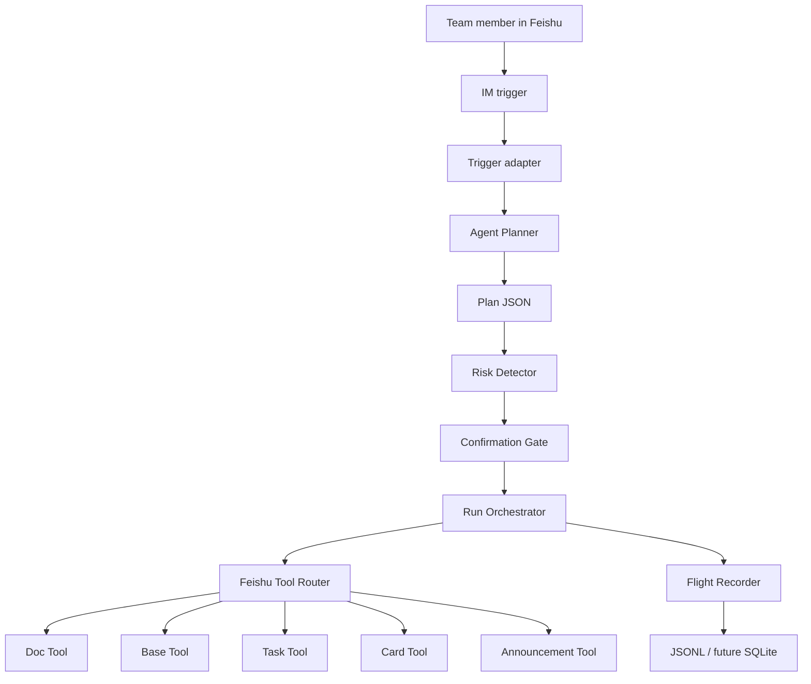
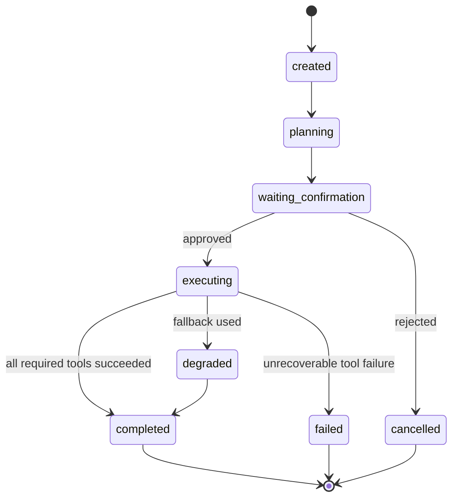
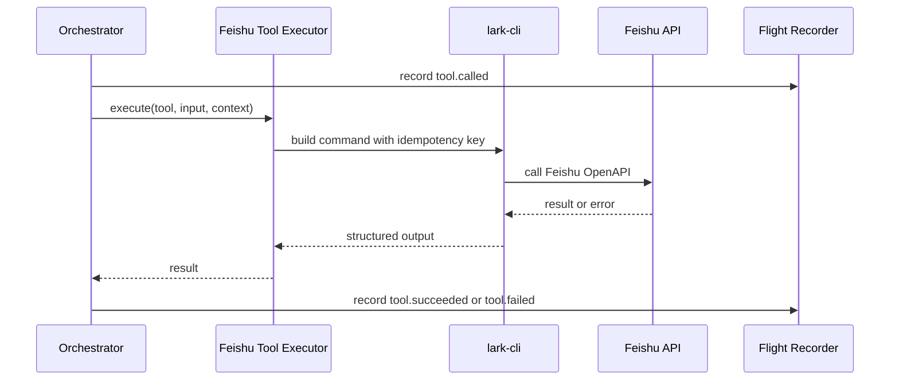
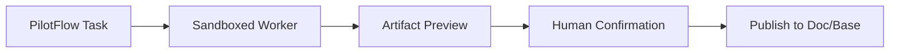

# Architecture

PilotFlow uses a deliberately small architecture for the first MVP:

```text
Single Agent + State Machine + Confirmation Gate + Feishu Tool Router + Flight Recorder
```

The goal is not to build a large multi-agent system first. The goal is to make one traceable, controllable Agent reliably operate Feishu-native surfaces.

## System Overview



## Core Components

| Component | Responsibility | Current status |
| --- | --- | --- |
| Trigger | Starts a run from manual input now, IM event later | manual trigger implemented |
| Planner | Converts input into project plan JSON | fixed demo planner implemented |
| Confirmation Gate | Stops side effects until human approval | flight plan card, dry-run auto-confirm, and live text fallback implemented |
| Duplicate Run Guard | Blocks accidental repeated live runs for the same project target | local guard file implemented under `tmp/run-guard/` |
| Orchestrator | Owns run lifecycle and tool sequence | Doc/Base/Task/entry/IM sequence implemented with artifact-aware messages and state rows |
| Feishu Tool Executor | Converts tool calls into `lark-cli` commands | dry-run and live-capable command runner implemented |
| Flight Recorder | Records events, tool calls, artifacts, failures | JSONL with step status and artifact events implemented |
| Risk Engine | Enriches planner risks and creates a decision summary | initial detector and risk decision card implemented |
| Cockpit | Shows run state and replay | static Flight Recorder HTML view implemented |

## Run State



## Data Model

The current schemas live in `src/schemas`.

| Schema | Meaning |
| --- | --- |
| `Run` | One execution of a PilotFlow workflow |
| `Plan` | Agent-generated project flight plan |
| `Step` | Unit of planned work |
| `ToolCall` | One call to a Feishu or local tool |
| `Confirmation` | Human approval gate |
| `Artifact` | Created Doc, Task, Base record, card, entry message, summary, or run log |
| `Risk` | Risk item detected or entered during planning |

Artifact normalization currently supports Feishu Doc, Base record batch writes, Task creation, card sends, project entry messages, IM message sends, and local run logs. Dry-run artifacts are marked `planned`; live artifacts are marked `created` once the corresponding `lark-cli` call succeeds. Base record artifacts also expose fallback fields such as `owner`, `due_date`, `risk_level`, `source_run`, `source_message`, and `url` for Flight Recorder and demo inspection.

The risk detector runs immediately after the plan is generated. It preserves planner risks and adds derived risks such as missing members, missing deliverables, non-concrete deadlines, and text-only owner mappings. The same detected risk list is used for the run output, Base risk rows, and optional risk decision card, so the product surfaces stay consistent.

The project flight plan card is generated before side effects and can be sent with `--send-plan-card`. The risk decision card is generated after Doc/Base/Task writes and can be sent with `--send-risk-card`. The project entry message is generated after Doc, Base, and Task calls complete and can be sent with `--send-entry-message` as the current fallback for a stable group entrance. The final IM summary is generated afterward, so the group message can include the created Doc URL, Base record IDs, Task URL, run ID, and next-step prompt.

The duplicate-run guard runs after live target preflight and before Feishu side effects. It computes a stable project-init key from normalized input, plan shape, profile, and hashed targets. The guard file lives in ignored local storage by default, so it protects live demos on the operator machine without publishing target IDs or secrets.

## Project State Rows

The current Base state template is shared by `setup:feishu` and the orchestrator:

| Field | Purpose |
| --- | --- |
| `type` | `task`, `risk`, or `artifact` |
| `title` | Human-readable item title |
| `owner` | Text fallback owner, before Feishu contact mapping is available |
| `due_date` | Text fallback due date, or `TBD` |
| `status` | `todo`, `open`, `planned`, `created`, or failure status |
| `risk_level` | Risk severity for risk rows |
| `source_run` | PilotFlow run ID |
| `source_message` | Source message ID when available, otherwise `manual-trigger` |
| `url` | Artifact link when already known |

This is intentionally text-first. Real assignee mapping to Feishu users remains a later step because it depends on contact lookup, scope readiness, and confirmation behavior.

## Tool Routing



## Feishu Execution Modes

| Mode | Purpose |
| --- | --- |
| `dry-run` | Build commands and record expected side effects without writing |
| `live` | Execute `lark-cli` against the activity tenant profile |
| `fallback` | Write local JSONL or text summary when a Feishu capability is blocked |

Runtime variables:

```text
PILOTFLOW_FEISHU_MODE=dry-run|live
PILOTFLOW_LARK_PROFILE=pilotflow-contest
PILOTFLOW_SEND_PLAN_CARD=true|false
PILOTFLOW_SEND_ENTRY_MESSAGE=true|false
PILOTFLOW_SEND_RISK_CARD=true|false
PILOTFLOW_DEDUPE_KEY=<optional_stable_key>
PILOTFLOW_ALLOW_DUPLICATE_RUN=true|false
PILOTFLOW_DISABLE_DUPLICATE_GUARD=true|false
PILOTFLOW_DUPLICATE_GUARD_PATH=tmp/run-guard/project-init-runs.json
PILOTFLOW_TEST_CHAT_ID=<oc_xxx>
PILOTFLOW_BASE_TOKEN=<base_token>
PILOTFLOW_BASE_TABLE_ID=<tbl_xxx>
PILOTFLOW_TASKLIST_ID=<tasklist_guid_or_url>
PILOTFLOW_CONFIRMATION_TEXT=确认起飞
```

Live mode requires the confirmation text `确认起飞`. It also preflights required Base and chat targets before the first Feishu write so a missing target does not create a partial Doc-only run.

## Reliability Rules

- Every write tool must receive an idempotency key.
- Live project-init runs must pass duplicate-run protection before visible side effects.
- Tool failures must stop or degrade the run explicitly.
- The Agent must never invent a successful Feishu write.
- Run logs must include planned input and actual output.
- Human confirmation is required before writing project artifacts.
- Local Windows execution bypasses shell string concatenation by invoking the installed `lark-cli` Node entrypoint with an argument array.

## Why Not Multi-Agent First

Multi-agent execution is useful later for worker artifacts, but it increases operational complexity. The MVP keeps one Agent in charge of planning and routing so the demo remains explainable, debuggable, and Feishu-native.

Worker route later:


