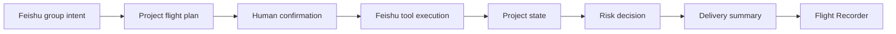

# PilotFlow Roadmap

This roadmap tracks what still needs to happen after the current validated prototype. It is intentionally forward-looking: completed history belongs in progress records and generated evidence, not in the public roadmap.

## Product Direction

PilotFlow is a Feishu-native project operations officer. It should help a team move from group discussion to confirmed plan, project artifacts, structured state, visible risks, and delivery summary without forcing the team into a separate project-management system.

Core loop:

## Current Status

| Area | Status | Boundary |
| --- | --- | --- |
| Manual project launch loop | Validated | One-command live flow can create Doc, Base rows, Task, group messages, and run trace |
| Feishu-native surfaces | Prototype validated | IM, Cards, Doc, Base, Task, pinned entry, and optional announcement path are integrated |
| Human confirmation | Stable fallback | Text confirmation is reliable; real card callback delivery is still pending platform configuration proof |
| Traceability | Implemented | JSONL run log, Flight Recorder, and review-pack generators are available |
| Review packaging | Implemented | Machine evidence can be regenerated locally; manual videos and screenshots remain outside Git |
| Product cleanup | In progress | Runtime entrypoints and review tooling are being separated from old demo-oriented paths |

## Phase 0: Foundation

- [x] Public repository and workspace created.
- [x] Official Feishu reference material collected outside the repo.
- [x] Product positioning narrowed to "AI project operations officer".
- [x] Activity tenant profile and core Feishu API capabilities validated.
- [x] Product README and documentation set established.

Exit condition: the project has a real Feishu development environment and a clear public product story.

## Phase 1: Real Feishu Loop

- [x] Add dry-run and live execution modes.
- [x] Add explicit profile and runtime configuration.
- [x] Validate plan schema before confirmation and side effects.
- [x] Add live preflight for required chat/Base targets.
- [x] Create Feishu Doc, Base records, Task, and IM summary from one confirmed run.
- [x] Normalize artifacts into run output and JSONL logs.
- [x] Add duplicate-run guard and short Feishu idempotency keys.
- [x] Add Flight Recorder static view.

Exit condition: a confirmed local command can create real Feishu artifacts and produce an inspectable run trace.

## Phase 2: Feishu-Native MVP

- [x] Flight-plan card with action protocol.
- [x] Risk detection and risk-decision card.
- [x] Project entry message and pinned-entry fallback.
- [x] Base owner/deadline/risk/source/url state fields.
- [x] Task assignee mapping through explicit `open_id` map.
- [x] Optional Contacts lookup for owner labels.
- [x] Bounded card listener and callback-trigger bridge.
- [x] Native group announcement attempt with pinned-entry fallback.
- [ ] Verify a real Feishu card button click reaches the listener and triggers the orchestrator.
- [ ] Capture a polished 6 to 8 minute happy-path walkthrough.
- [ ] Capture a focused failure-path walkthrough or screenshot set.
- [ ] Capture Open Platform permission and callback configuration screenshots.

Exit condition: PilotFlow can be demonstrated as a Feishu-native project operations assistant without relying on unstated assumptions.

## Phase 3: Productization Cleanup

- [x] Write the productization refactor plan.
- [ ] Freeze public product claims in README, Product Spec, and Roadmap.
- [ ] Consolidate `docs/demo/` into a compact demo kit.
- [x] Move product CLI entrypoints out of `src/demo/`.
- [x] Move review/evidence generators into `src/review-packs/`.
- [x] Replace public `demo:*` commands with `pilot:*` and `review:*` commands.
- [x] Split `run-orchestrator.js` into smaller runtime and domain modules.
- [x] Add `pilot:doctor` for local environment checks.
- [ ] Re-run full validation and update workspace progress records.

Exit condition: product runtime, review packaging, and documentation are visibly separated.

## Phase 4: Strong MVP Enhancements

- [ ] Mobile-friendly confirmation once callback delivery is verified.
- [ ] Desktop or Chat Tab cockpit for run status, artifacts, risks, and retry decisions.
- [ ] Choose one additional Feishu-native surface:
  - Whiteboard for roadmap visualization.
  - Calendar for milestone scheduling.
- [ ] Worker artifact preview for document, table, script, or research outputs.
- [ ] Human approval before publishing worker artifacts into Feishu.

Exit condition: PilotFlow feels useful beyond the first project-launch flow while keeping human control intact.

## Phase 5: Product-Ready Direction

- [ ] Event-driven group trigger with allowlisted groups.
- [ ] Multi-project space management.
- [ ] Persistent project memory.
- [ ] Permission and audit model.
- [ ] Evaluation cases for planning, confirmation, retry, idempotency, and fallback.
- [ ] Deployment package.
- [ ] Public docs site or GitHub Pages.

## Immediate Next Actions

1. Finish the productization cleanup phases in [`PRODUCTIZATION_REFACTOR_PLAN.md`](PRODUCTIZATION_REFACTOR_PLAN.md).
2. Regenerate review packs with the new `review:*` command surface.
3. Run `pilot:doctor`, `pilot:check`, tests, review package generation, status, and safety audit.
4. Capture happy-path and failure-path media outside Git.
5. Verify Open Platform card callback delivery or keep it explicitly marked as pending.
