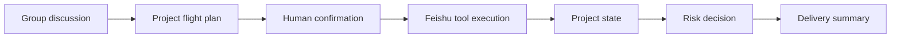

# PilotFlow Roadmap

This roadmap is the product and engineering plan for turning PilotFlow from a validated prototype into a Feishu-native MVP.

## Product Direction

PilotFlow is a project operations officer inside Feishu group chats. It should help a team move from discussion to delivery without forcing everyone into a separate project-management system.

## Current Planning Update

Status after the latest implementation pass:

- Phase 1 is effectively closed: the manual trigger can create real Feishu artifacts and return a traceable run.
- Phase 2 should now prioritize stable Feishu-native product surfaces over heavier automation.
- Card callback action protocol, bounded listener process, and callback-trigger bridge are implemented locally. A live listener connected to Feishu successfully, but no `card.action.trigger` event was received in the two-minute validation window; text confirmation remains the fallback until Open Platform callback configuration is verified.
- Group announcement has been attempted through the native announcement API. The test group currently returns `232097 Unable to operate docx type chat announcement`, so the product path now records the failed announcement upgrade and keeps the pinned entry message as the stable Feishu-native entrance.
- Base owner/deadline fallback, local Flight Recorder view, risk detection, live risk decision card send, live pinned entry message, explicit Task assignee mapping, optional Contacts-based owner lookup, plan-validation fallback, card callback action protocol, and a bounded card listener are now implemented. The next product slice should harden the demo, capture evidence, and resolve platform callback configuration.
- Phase 3 demo hardening has started: the latest live run now has a generated Flight Recorder HTML view and Markdown evidence pack, `docs/demo/` contains the demo playbook, reviewer Q&A, fallback/no-network explanation, local demo evaluation pack, capture pack, failure-path demo pack, readiness gate, permission appendix pack, callback verification pack, judge review pack, submission pack, delivery index, and safety audit pack for callback timeout, announcement fallback, invalid plan, duplicate run, requirement-risk cases, scope evidence, product claims, manual capture work, review packaging, and leak prevention.
- Submission readiness is now split into machine evidence and manual media: the generated submission pack can report whether evidence is ready while keeping videos and screenshots outside Git.
- Capture manifest template generation is available so manual videos and screenshots can be tracked without committing raw media.
- Submission reports now include file size, SHA-256, and optional reviewer metadata for captures listed in the manifest, making external media traceable without moving it into Git.
- Demo delivery index generation is available as a local review-packaging start page across public docs, generated evidence, trace artifacts, and manual capture state.
- Demo safety audit generation is available as a pattern-based gate for public docs, generated review material, Flight Recorder output, and source files.
- Project cleanup pass is now part of demo hardening: generated evidence pack scripts are isolated under `src/demo/packs/`, while `pilot:*` commands provide a small product-facing command surface.

Main loop:



## Phase 0: Foundation and API Flight Test

Status: mostly complete.

- [x] Create workspace and public GitHub repository.
- [x] Collect Feishu official reference docs outside the repo.
- [x] Define positioning as "AI project operations officer".
- [x] Create executable roadmap checklist.
- [x] Upgrade `lark-cli` to `1.0.21`.
- [x] Create activity tenant profile `pilotflow-contest`.
- [x] Validate Feishu group creation.
- [x] Validate group IM send.
- [x] Validate static card send.
- [x] Validate Doc create.
- [x] Validate Task create.
- [x] Validate Base create/write.
- [x] Validate JSONL run logging.

Exit condition:

- [x] P0 Feishu capabilities are validated enough to start product integration.

## Phase 1: 72-Hour MVP Loop

Goal: connect the current dry-run skeleton to real Feishu tools while keeping a manual trigger.

Target loop:

```text
Manual trigger -> JSON plan -> confirmation -> Doc -> Base/Task -> IM summary -> JSONL run log
```

Work items:

- [x] Add runtime mode: `dry-run` vs `live`.
- [x] Add explicit profile support for `pilotflow-contest`.
- [x] Implement live-capable `doc.create` command path in the orchestrator.
- [x] Implement live-capable `base.write` command path for tasks, risks, artifacts, confirmations.
- [x] Implement live-capable `task.create` command path for action items.
- [x] Implement live-capable `im.send` command path for final summary.
- [x] Add confirmation text fallback: "确认起飞".
- [x] Add step status updates in run logs.
- [x] Add live preflight so missing Base/chat targets fail before side effects.
- [x] Normalize Doc/Base/Task/IM artifacts into final run output and JSONL logs.
- [x] Run confirmed live mode against the target test group and Base.
- [x] Validate live artifact IDs and URLs against real `lark-cli` responses.
- [x] Add Feishu-native project flight plan card builder.
- [x] Add optional `--send-plan-card` flow with text-confirmation wait state.
- [x] Add artifact-aware final summary text.
- [x] Add `demo_success_run.json`.
- [x] Add `demo_partial_failure_run.json`.
- [x] Add fallback plan when plan schema validation fails.

Exit condition:

- [x] One local command creates a real Feishu Doc, writes state, creates at least one Task or Base record, sends a summary to the test group, and records every step.

## Phase 2: Standard Feishu-Native MVP

Goal: turn the minimum loop into a product-shaped Feishu-native experience.

Target loop:

```text
IM + Cards + Doc + Group Announcement + Base + Task + Risk + Flight Recorder
```

Work items:

- [x] Design and send a project flight plan card.
- [x] Add card buttons for confirm, edit, doc-only, cancel.
- [x] Add local callback parser/handler for flight-plan and risk-card actions.
- [x] Add a bounded card callback event listener and callback-trigger bridge.
- [ ] Verify a real Feishu card button click triggers the orchestrator in the test group.
- [x] Run a bounded live listener attempt for `card.action.trigger`; WebSocket connected, but no callback event was received.
- [x] Implement text confirmation fallback when card callback is blocked.
- [x] Shorten Feishu write idempotency keys to avoid message field validation errors.
- [x] Add duplicate-run guard before more live demo repetitions.
- [x] Create a Base template with fields:
  - `type`
  - `title`
  - `owner`
  - `due_date`
  - `status`
  - `risk_level`
  - `source_run`
  - `source_message`
  - `url`
- [x] Create real task records with owner/deadline when owner open_id mappings are configured.
- [x] Add owner mapping fallback to text fields.
- [x] Add automatic contact lookup for owner labels.
- [x] Try group announcement update.
- [x] Fall back to a project entry message if announcement update fails.
- [x] Pin the project entry message with `im.pins.create` as a Feishu-native stable-entry upgrade.
- [x] Record announcement API failure as a non-blocking artifact and continue the main run.
- [x] Build a lightweight Flight Recorder view.
- [x] Add risk detection:
  - planner risk enrichment
  - missing member detection
  - missing deliverable detection
  - non-concrete deadline detection
  - owner text fallback detection
- [x] Add optional risk decision card with action buttons:
  - confirm owner
  - adjust deadline
  - accept and track
  - defer

Exit condition:

- [ ] A 6 to 8 minute demo can run in the real test group and show IM, card, Doc, Base/Task, project entry, risk handling, summary, and run trace.

## Phase 3: Demo Hardening

Goal: make the MVP stable enough for live evaluation.

- [ ] Create a happy-path recording.
- [ ] Create a partial-failure recording.
- [ ] Capture API permission screenshots.
- [x] Generate tool-call and run-log evidence pack from the latest live run.
- [x] Prepare demo script.
- [x] Prepare Q&A answers.
- [x] Prepare failure-path and no-network fallback explanation.
- [x] Add local demo evaluation cases for missing owner, vague deadline, invalid plan, duplicate writes, and optional tool failure.
- [x] Add demo capture pack for recording order, screenshot checklist, evidence anchors, and boundaries.
- [x] Add failure-path demo pack for callback timeout, announcement fallback, invalid plan, duplicate run, and requirement-risk scenarios.
- [x] Add demo readiness pack for evidence/docs gatekeeping before manual recording and screenshot capture.
- [x] Add permission appendix pack for sanitized CLI evidence, scope coverage, screenshot checklist, and callback configuration boundaries.
- [x] Add callback verification pack for card payload readiness, listener connection evidence, and real callback-event status.
- [x] Fold permission and callback verification evidence into the demo readiness gate.
- [x] Add judge review pack for reviewer-facing product story, evidence sources, boundaries, reproduction commands, and next actions.
- [x] Add demo submission pack for machine evidence and manual capture manifest status.
- [x] Add capture manifest template generation for manual recordings and screenshots.
- [x] Add capture file size and SHA-256 reporting for submission manifests.
- [x] Add capture reviewer metadata display for submission manifests.
- [x] Add demo delivery index for review-packaging navigation and evidence status.
- [x] Add demo safety audit pack for secret-like value and private identifier scanning.
- [x] Separate demo/evidence pack scripts from the product demo runtime.
- [x] Add `pilot:*` command facade for the common validation, demo, package, status, and audit flows.
- [x] Keep a pre-generated Feishu Doc/Base/Task set for backup.

Exit condition:

- [ ] Demo can be delivered live or by recording without relying on unstated assumptions.

## Phase 4: Strong MVP Enhancements

Only start after Phase 2 is stable.

- [ ] Mobile confirmation flow.
- [ ] Desktop Flight Recorder cockpit.
- [x] Risk decision card prototype.
- [ ] Whiteboard or Calendar, choose one:
  - Whiteboard: project roadmap visualization.
  - Calendar: milestone schedule suggestion or event creation.
- [ ] Worker artifact preview:
  - document worker
  - table cleanup worker
  - script automation worker

Rules:

- Worker artifacts must not write to Feishu directly.
- PilotFlow publishes worker output only after human confirmation.
- Worker is a supporting route, not the core product packaging.

## Phase 5: Productization

Longer-term direction after competition MVP.

- [ ] Event-driven group trigger.
- [ ] Multi-group project space management.
- [ ] Persistent project memory.
- [ ] Permission and audit model.
- [ ] Eval cases for planning, confirmation, retry, idempotency, and fallback.
- [ ] Deployment package.
- [ ] Public docs site or GitHub Pages.

## Immediate Next Actions

1. Generate the Demo Readiness Pack before each recording attempt and confirm it reports `ready_for_manual_capture`.
2. Use `npm run pilot:package`, `npm run pilot:status`, and `npm run pilot:audit` as the default review-material flow; keep individual `demo:*` commands for advanced regeneration only.
3. Record the first happy-path walkthrough using the generated Capture Pack: rich Base fields, risk card, pinned entry, announcement fallback, Flight Recorder, Evidence Pack, and Eval Pack.
4. Record or screenshot the failure-path walkthrough from the Failure-Path Demo Pack: callback timeout, announcement fallback, invalid plan, duplicate-run guard, and unclear-requirement risks.
5. Generate the Permission Appendix Pack and use it as the capture checklist for API permission and callback configuration screenshots.
6. Generate the Callback Verification Pack after each listener attempt so callback status has one consistent report.
7. Generate the Judge Review Pack after the readiness, permission, and callback verification packs so reviewers have one entry document for claims, evidence, commands, and boundaries.
8. Capture API permission and callback configuration screenshots for the evaluation appendix.
9. Verify Open Platform card callback configuration so `card.action.trigger` reaches the listener; keep text confirmation as fallback.
10. Treat group announcement as a documented platform limitation for this test group and keep pinned entry-message fallback as the default stable path.
11. Prepare risk-card callback persistence after live event wiring is verified.
12. Keep README and docs updated with each implementation step.
13. Commit and push every completed vertical slice to GitHub.

## Long-Term Roadmap

### Week 1: Real Feishu Loop

- [x] Replace dry-run tool outputs with live mode behind an explicit flag.
- [x] Use environment variables for test chat, Base, table, and profile.
- [x] Make `npm run demo:manual -- --live` create real artifacts.
- [x] Add idempotency or duplicate-run guard for every write.
- [ ] Add screenshots or recordings only after the flow is stable.

### Week 2: Product-Shaped MVP

- [x] Add text confirmation fallback.
- [x] Add Base template setup command.
- [x] Add card callback action protocol.
- [x] Add bounded card listener and callback-trigger bridge.
- [ ] Verify live card callback confirmation from a real Feishu button click.
- [x] Fix live card send failure caused by overlong Feishu idempotency keys.
- [x] Add owner fallback text fields.
- [x] Add Task assignee mapping with explicit owner/open_id map.
- [x] Add automatic contact lookup for owner labels.
- [x] Add entry-message fallback.
- [x] Add pinned entry-message upgrade.
- [x] Try full group announcement update.
- [x] Add risk decision summary.
- [x] Add Flight Recorder viewer.

### Week 3: Demo and Evaluation

- [x] Prepare a complete 6 to 8 minute demo script.
- [x] Add demo Q&A and fallback explanation docs.
- [x] Add evidence pack generation for latest live run logs.
- [x] Add eval cases for missing owner, vague deadline, duplicate writes, invalid plan, and tool failure.
- [x] Add capture pack generation for recording and screenshot planning.
- [x] Add failure-path demo pack.
- [x] Add demo readiness gate.
- [x] Add permission appendix pack.
- [x] Add callback verification pack.
- [x] Add permission and callback evidence to readiness gate.
- [x] Add judge review pack.
- [x] Add demo submission pack.
- [x] Add demo delivery index.
- [x] Add demo safety audit pack.
- [ ] Record failure-path demo video.
- [x] Harden docs and README for judges and GitHub visitors with demo delivery index.
- [x] Push all repo updates promptly.

### Week 4+: Expansion

- [ ] IM event subscription and allowlisted group trigger.
- [ ] Multi-project spaces.
- [ ] Whiteboard or Calendar enhancement.
- [ ] Worker artifact sandbox route.
- [ ] Deployment and public docs site.
