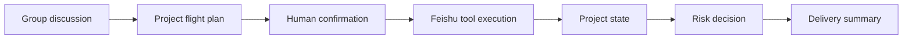

# PilotFlow Roadmap

This roadmap is the product and engineering plan for turning PilotFlow from a validated prototype into a Feishu-native MVP.

## Product Direction

PilotFlow is a project operations officer inside Feishu group chats. It should help a team move from discussion to delivery without forcing everyone into a separate project-management system.

## Current Planning Update

Status after the latest implementation pass:

- Phase 1 is effectively closed: the manual trigger can create real Feishu artifacts and return a traceable run.
- Phase 2 should now prioritize stable Feishu-native product surfaces over heavier automation.
- Card callback remains useful, but it depends on event/callback wiring and permissions. Text confirmation remains the fallback.
- Group announcement is still a risk area, so the near-term project-entry path is a pinned entry message that can later be upgraded to an announcement.
- Base owner/deadline fallback, local Flight Recorder view, risk detection, a dry-run risk decision card, a pinned entry-message prototype, explicit Task assignee mapping, optional Contacts-based owner lookup, and plan-validation fallback are now implemented. The next product slice should move toward card callback readiness, group announcement upgrade attempts, and demo hardening while keeping text confirmation, pinned entry fallback, and risk-card dry-run behavior.

Main loop:



## Phase 0: Foundation and API Flight Test

Status: mostly complete.

- [x] Create workspace and public GitHub repository.
- [x] Collect Feishu official reference docs outside the repo.
- [x] Define positioning as "AI project operations officer".
- [x] Create executable roadmap checklist.
- [x] Upgrade `lark-cli` to `1.0.20`.
- [x] Create activity tenant profile `pilotflow-contest`.
- [x] Validate Feishu group creation.
- [x] Validate group IM send.
- [x] Validate static card send.
- [x] Validate Doc create.
- [x] Validate Task create.
- [x] Validate Base create/write.
- [x] Validate JSONL run logging.

Exit condition:

- [x] P0 Feishu capabilities are validated enough to start product integration.

## Phase 1: 72-Hour MVP Loop

Goal: connect the current dry-run skeleton to real Feishu tools while keeping a manual trigger.

Target loop:

```text
Manual trigger -> JSON plan -> confirmation -> Doc -> Base/Task -> IM summary -> JSONL run log
```

Work items:

- [x] Add runtime mode: `dry-run` vs `live`.
- [x] Add explicit profile support for `pilotflow-contest`.
- [x] Implement live-capable `doc.create` command path in the orchestrator.
- [x] Implement live-capable `base.write` command path for tasks, risks, artifacts, confirmations.
- [x] Implement live-capable `task.create` command path for action items.
- [x] Implement live-capable `im.send` command path for final summary.
- [x] Add confirmation text fallback: "确认起飞".
- [x] Add step status updates in run logs.
- [x] Add live preflight so missing Base/chat targets fail before side effects.
- [x] Normalize Doc/Base/Task/IM artifacts into final run output and JSONL logs.
- [x] Run confirmed live mode against the target test group and Base.
- [x] Validate live artifact IDs and URLs against real `lark-cli` responses.
- [x] Add Feishu-native project flight plan card builder.
- [x] Add optional `--send-plan-card` flow with text-confirmation wait state.
- [x] Add artifact-aware final summary text.
- [x] Add `demo_success_run.json`.
- [x] Add `demo_partial_failure_run.json`.
- [x] Add fallback plan when plan schema validation fails.

Exit condition:

- [x] One local command creates a real Feishu Doc, writes state, creates at least one Task or Base record, sends a summary to the test group, and records every step.

## Phase 2: Standard Feishu-Native MVP

Goal: turn the minimum loop into a product-shaped Feishu-native experience.

Target loop:

```text
IM + Cards + Doc + Group Announcement + Base + Task + Risk + Flight Recorder
```

Work items:

- [x] Design and send a project flight plan card.
- [ ] Support card buttons for confirm, edit, doc-only, cancel.
- [x] Implement text confirmation fallback when card callback is blocked.
- [x] Add duplicate-run guard before more live demo repetitions.
- [x] Create a Base template with fields:
  - `type`
  - `title`
  - `owner`
  - `due_date`
  - `status`
  - `risk_level`
  - `source_run`
  - `source_message`
  - `url`
- [x] Create real task records with owner/deadline when owner open_id mappings are configured.
- [x] Add owner mapping fallback to text fields.
- [x] Add automatic contact lookup for owner labels.
- [ ] Try group announcement update.
- [x] Fall back to a project entry message if announcement update fails.
- [x] Pin the project entry message with `im.pins.create` as a Feishu-native stable-entry upgrade.
- [x] Build a lightweight Flight Recorder view.
- [x] Add risk detection:
  - planner risk enrichment
  - missing member detection
  - missing deliverable detection
  - non-concrete deadline detection
  - owner text fallback detection
- [x] Add optional risk decision card with action buttons:
  - confirm owner
  - adjust deadline
  - accept and track
  - defer

Exit condition:

- [ ] A 6 to 8 minute demo can run in the real test group and show IM, card, Doc, Base/Task, project entry, risk handling, summary, and run trace.

## Phase 3: Demo Hardening

Goal: make the MVP stable enough for live evaluation.

- [ ] Create a happy-path recording.
- [ ] Create a partial-failure recording.
- [ ] Capture API permission screenshots.
- [ ] Capture tool call and run log screenshots.
- [ ] Prepare demo script.
- [ ] Prepare Q&A answers.
- [ ] Prepare no-network fallback explanation.
- [ ] Keep a pre-generated Feishu Doc/Base/Task set for backup.

Exit condition:

- [ ] Demo can be delivered live or by recording without relying on unstated assumptions.

## Phase 4: Strong MVP Enhancements

Only start after Phase 2 is stable.

- [ ] Mobile confirmation flow.
- [ ] Desktop Flight Recorder cockpit.
- [x] Risk decision card prototype.
- [ ] Whiteboard or Calendar, choose one:
  - Whiteboard: project roadmap visualization.
  - Calendar: milestone schedule suggestion or event creation.
- [ ] Worker artifact preview:
  - document worker
  - table cleanup worker
  - script automation worker

Rules:

- Worker artifacts must not write to Feishu directly.
- PilotFlow publishes worker output only after human confirmation.
- Worker is a supporting route, not the core product packaging.

## Phase 5: Productization

Longer-term direction after competition MVP.

- [ ] Event-driven group trigger.
- [ ] Multi-group project space management.
- [ ] Persistent project memory.
- [ ] Permission and audit model.
- [ ] Eval cases for planning, confirmation, retry, idempotency, and fallback.
- [ ] Deployment package.
- [ ] Public docs site or GitHub Pages.

## Immediate Next Actions

1. Check event/callback readiness for card button confirmation; keep text confirmation as fallback.
2. Try full group announcement update only after confirming the API and permission path; keep pinned entry-message fallback as the default stable path.
3. Prepare the first happy-path recording after a fresh rich Base table is created.
4. Prepare risk-card callback handling after event/callback readiness is verified.
5. Keep README and docs updated with each implementation step.
6. Commit and push every completed vertical slice to GitHub.

## Long-Term Roadmap

### Week 1: Real Feishu Loop

- [x] Replace dry-run tool outputs with live mode behind an explicit flag.
- [x] Use environment variables for test chat, Base, table, and profile.
- [x] Make `npm run demo:manual -- --live` create real artifacts.
- [x] Add idempotency or duplicate-run guard for every write.
- [ ] Add screenshots or recordings only after the flow is stable.

### Week 2: Product-Shaped MVP

- [x] Add text confirmation fallback.
- [x] Add Base template setup command.
- [ ] Add card callback confirmation.
- [x] Add owner fallback text fields.
- [x] Add Task assignee mapping with explicit owner/open_id map.
- [x] Add automatic contact lookup for owner labels.
- [x] Add entry-message fallback.
- [x] Add pinned entry-message upgrade.
- [ ] Try full group announcement update.
- [x] Add risk decision summary.
- [x] Add Flight Recorder viewer.

### Week 3: Demo and Evaluation

- [ ] Prepare a complete 6 to 8 minute demo.
- [ ] Add eval cases for missing owner, deadline conflict, duplicate writes, and tool failure.
- [ ] Add failure-path demo.
- [ ] Harden docs and README for judges and GitHub visitors.
- [ ] Push all repo updates promptly.

### Week 4+: Expansion

- [ ] IM event subscription and allowlisted group trigger.
- [ ] Multi-project spaces.
- [ ] Whiteboard or Calendar enhancement.
- [ ] Worker artifact sandbox route.
- [ ] Deployment and public docs site.
