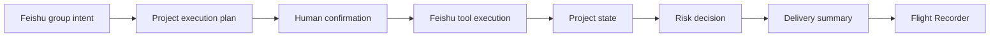

# PilotFlow Roadmap

This roadmap tracks what still needs to happen after the current validated prototype. It is intentionally forward-looking: completed history belongs in progress records and generated evidence, not in the public roadmap.

## Product Direction

PilotFlow is a Feishu-native project operations officer. It should help a team move from group discussion to confirmed plan, project artifacts, structured state, visible risks, and delivery summary without forcing the team into a separate project-management system.

Core loop:

## Current Status

| Area | Status | Boundary |
| --- | --- | --- |
| Manual project launch loop | Useful prototype | The older JS path has real Feishu proof; it is not a production bot. |
| Feishu-native surfaces | Partially live validated | IM, Cards, Doc, Base, Task, pinned entry, risk card, and summary are real; TS mention gateway exists locally, but announcement and callback are not complete. |
| Human confirmation | Stable fallback | Text confirmation works; real card button confirmation remains pending. |
| Traceability | Implemented | JSONL run log, Flight Recorder, and review packs make runs inspectable. |
| Review packaging | Implemented but auxiliary | Useful for competition evidence; it must not become the product center. |
| Product cleanup | Mostly implemented | Runtime entrypoints, review tooling, command facade, and public demo docs are separated. |
| TypeScript kernel rebuild | Dry-run and single live run validated | Day 0 through Day 7 are implemented; `pilot:run` has one real live Feishu proof, while repeated parity and callback checks remain. |
| Hermes-style evolution | Review loop only | Retrospective, eval, and preview worker exist; memory, compression, approval cards, and real worker orchestration remain future work. |

For the authoritative maturity boundary, read [`PRODUCT_REALITY_CHECK.md`](PRODUCT_REALITY_CHECK.md).

## Phase 0: Foundation

- [x] Public repository and workspace created.
- [x] Official Feishu reference material collected outside the repo.
- [x] Product positioning narrowed to "AI project operations officer".
- [x] Activity tenant profile and core Feishu API capabilities validated.
- [x] Product README and documentation set established.

Exit condition: the project has a real Feishu development environment and a clear public product story.

## Phase 1: Real Feishu Loop

- [x] Add dry-run and live execution modes.
- [x] Add explicit profile and runtime configuration.
- [x] Validate plan schema before confirmation and side effects.
- [x] Add live preflight for required chat/Base targets.
- [x] Create Feishu Doc, Base records, Task, and IM summary from one confirmed run.
- [x] Normalize artifacts into run output and JSONL logs.
- [x] Add duplicate-run guard and short Feishu idempotency keys.
- [x] Add Flight Recorder static view.

Exit condition: a confirmed local command can create real Feishu artifacts and produce an inspectable run trace.

## Phase 2: Feishu-Native MVP

- [x] Execution-plan card with action protocol.
- [x] Risk detection and risk-decision card.
- [x] Project entry message and pinned-entry fallback.
- [x] Base owner/deadline/risk/source/url state fields.
- [x] Task assignee mapping through explicit `open_id` map.
- [x] Optional Contacts lookup for owner labels.
- [x] Bounded card listener and callback-trigger bridge.
- [x] Native group announcement attempt with pinned-entry fallback.
- [x] Local TS IM mention gateway bridge with pending-run continuation for approved card callbacks and same-chat text confirmation.
- [x] Add bounded gateway probes with structured `timeout` and `subscribe_failed` results.
- [x] Add `--send-probe-message` to start the gateway listener and send a repeatable IM smoke request.
- [x] Make the default IM probe require a real bot `user_id` so it sends a structured mention.
- [x] Add a live-check warning when `PILOTFLOW_BOT_USER_ID` is missing.
- [x] Add a live-check warning when the IM receive event scope is missing.
- [x] Add a live-check dry-run check for the `im.message.receive_v1` subscription command.
- [x] Add a live-check event bus status check to catch competing local subscribers.
- [x] Refuse live gateway IM probes before sending when `im:message.p2p_msg:readonly` is missing.
- [x] Add structured live-check next actions for IM event blockers.
- [x] Add structured callback-proof next actions for timeout and subscription failure cases.
- [x] Start callback-proof listener before sending the probe card, and classify probe send failures separately.
- [x] Fail callback-proof before sending a probe card when event subscription fails during startup.
- [ ] Verify a real Feishu card button click reaches the listener and triggers the orchestrator; the 2026-05-01 probe card send succeeded, but no callback arrived within 30 seconds.
- [ ] Verify `im.message.receive_v1` delivery; the structured mention probe now sends, but no IM event arrived within 60 seconds.
- [ ] Capture a polished 6 to 8 minute happy-path walkthrough.
- [ ] Capture a focused failure-path walkthrough or screenshot set.
- [ ] Capture Open Platform permission and callback configuration screenshots.

Exit condition: PilotFlow can be demonstrated as a Feishu-native project operations assistant without relying on unstated assumptions.

## Phase 3: Productization Cleanup

- [x] Write the productization refactor plan.
- [x] Freeze public product claims in README, Product Spec, and Roadmap.
- [x] Consolidate `docs/demo/` into a compact demo kit.
- [x] Move product CLI entrypoints out of `src/demo/`.
- [x] Move review/evidence generators into `src/review-packs/`.
- [x] Replace public `demo:*` commands with `pilot:*` and `review:*` commands.
- [x] Split `run-orchestrator.js` into smaller runtime and domain modules.
- [x] Add `pilot:doctor` for local environment checks.
- [x] Re-run full validation and update workspace progress records.

Exit condition: product runtime, review packaging, and documentation are visibly separated.

## Phase 3B: Hermes-Style TypeScript Kernel Rebuild

- [x] Day 0: external contracts checked and recorded in `docs/rebuild/CONTRACT_NOTES.md`.
- [x] Day 1: strict TS foundation, shared utilities, safety layer, infrastructure, runtime config, and TS test bridge.
- [x] Day 2: TS domain modules, ToolRegistry, tool idempotency, and 9 Feishu tool definitions.
- [x] Day 3: split the orchestrator into confirmation gate, tool sequence, duplicate guard, cards, project state, entry, summary, and resolver modules.
- [x] Day 4: add Feishu gateway, session queue, Agent loop, and mock-tested LLM provider.
- [x] Day 5: bridge TS gateway/agent into CLI dry-run smoke paths and keep live migration guarded.
- [x] Day 6: bridge TS runtime into a live-guarded project-init path; old JS runtime removal remains gated by repeated live parity and callback validation.
- [x] Day 7: add `pilot:run` product facade, retrospective eval runner, and preview-only Review Worker contract.

Exit condition: TypeScript path can run the same dry-run and live-guarded project launch loop as the current JS prototype, then pass repeated real Feishu validation before old runtime removal.

## Phase 4: Strong MVP Enhancements

- [ ] Mobile-friendly confirmation once callback delivery is verified.
- [ ] Desktop or Chat Tab cockpit for run status, artifacts, risks, and retry decisions.
- [x] Run Retrospective Pack generated from Flight Recorder traces.
- [x] Add initial Retrospective Eval runner for optional fallback, missing owner, TBD deadline, planner validation fallback, and tool failure trace.
- [ ] Promote retrospective eval cases into a broader fixture suite with real run snapshots.
- [ ] Add project memory schema for team preferences, recurring owners, project templates, and platform limits.
- [ ] Add bounded context compression for old tool outputs and long group sessions.
- [ ] Choose one additional Feishu-native surface:
  - Whiteboard for roadmap visualization.
  - Calendar for milestone scheduling.
- [x] Add first preview-only Review Worker contract.
- [ ] Worker artifact preview for document, table, script, or research outputs.
- [ ] Human approval cards before publishing worker artifacts into Feishu.

Exit condition: PilotFlow feels useful beyond the first project-launch flow while keeping human control intact.

## Phase 5: Product-Ready Direction

- [ ] Event-driven group trigger with allowlisted groups.
- [ ] Multi-project space management.
- [ ] Persistent project memory.
- [x] Typed `WorkerRequest` and `WorkerResult` contract for the first Review Worker.
- [ ] Manager-worker orchestration across multiple worker types.
- [ ] Feishu worker progress cards and artifact approval cards.
- [ ] Self-evolution loop: trace -> evaluation -> improvement proposal -> approved workflow/template/test update.
- [ ] Permission and audit model.
- [ ] Evaluation cases for planning, confirmation, retry, idempotency, and fallback.
- [ ] Deployment package.
- [ ] Public docs site or GitHub Pages.

## Immediate Next Actions

1. Repeat `npm run pilot:run -- --live --confirm "确认执行"` with fresh dedupe keys, then compare the live artifacts with the older JS live proof.
2. Inspect Open Platform callback/event settings for the `card.action.trigger` gap, then rerun `npm run pilot:callback-proof -- --send-probe-card --timeout 60s`.
3. Enable/authorize `im:message.p2p_msg:readonly`, inspect Open Platform long-connection and `im.message.receive_v1` settings, then rerun `pilot:gateway -- --live --send-probe-message --timeout 60s --max-events 1 --json`.
4. Promote Retrospective Eval cases into snapshot-backed fixtures from real successful and degraded runs.
5. Capture happy-path and failure-path media outside Git, then rerun `pilot:status` until the package is no longer `needs_regeneration`.
6. Only after the main Feishu loop is stable, design the first artifact approval card for worker previews.
7. Run `pilot:doctor`, `pilot:check`, tests, review package generation, status, and safety audit before any public handoff.
