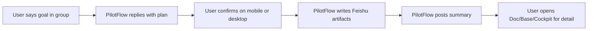
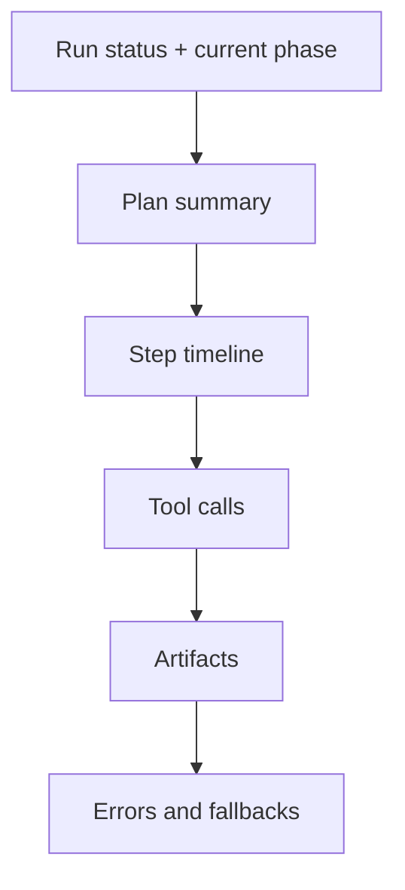

# Visual Design

PilotFlow should feel like a Feishu-native operations layer, not a separate marketing website or a heavy dashboard.

## Design Direction

| Surface | Design goal |
| --- | --- |
| IM | Clear, short, action-oriented messages |
| Cards | Decision and confirmation UI |
| Docs | Structured project artifacts |
| Base | Dense project state table |
| Tasks | Action items with owner/deadline |
| Pinned entry | Stable project entrance inside the group |
| Cockpit | Trace and replay, not the primary workspace |

## Interaction Model

## Card Design

Project execution plan card:

| Region | Content |
| --- | --- |
| Header | Project name and status |
| Summary | Goal, deadline, deliverables |
| Plan | 3 to 6 steps |
| Risks | Missing owner, deadline conflict, uncertainty |
| Actions | Confirm, edit plan, doc only, cancel |

Risk decision card:

| Region | Content |
| --- | --- |
| Header | Risk level |
| Context | Goal, source run, and risk overview |
| Options | Accept risk, assign owner, change deadline, defer |
| Result | Current prototype records the card action protocol and keeps text confirmation as fallback until real button-click validation passes |

## Cockpit Layout

The cockpit should be compact and operational.

## Visual Rules

- Prioritize dense, scannable information over decorative hero layouts.
- Use Feishu-native cards and tables before custom UI.
- Keep status language consistent:
  - `planned`
  - `waiting_confirmation`
  - `executing`
  - `degraded`
  - `completed`
  - `failed`
- Use restrained colors:
  - success: green
  - warning: amber
  - risk: red
  - neutral state: gray
  - PilotFlow accent: blue
- Avoid decorative gradients, oversized hero panels, and card-inside-card layouts.
- Every button should represent a clear command.

## README Visual Standard

The GitHub README should stay visually rich and useful:

- project headline
- bilingual positioning
- badges
- product loop diagram
- architecture diagram
- feature/status table
- quick start
- roadmap snapshot
- docs index
- safety principles

Future assets:

- demo GIF or short recording
- screenshot of Feishu card
- screenshot of generated Doc
- screenshot of Base state table
- screenshot of Flight Recorder
